# Mermaid Diagram Color Contrast Guide

## What is Color Contrast?

**Color contrast** is the difference in brightness between text (or lines) and its background. Good contrast makes your diagrams readable by everyone, including people with vision impairments or color blindness.

### Why Does This Matter?

| Problem | Impact |
|---------|--------|
| **Poor contrast** (light text on light background) | Hard to read, impossible for some users |
| **Good contrast** (dark text on light, or white text on dark) | Readable by everyone, meets accessibility standards |

---

## The Quick Fix: Use an Accessible Color Palette

Instead of guessing colors, use this **pre-tested accessible palette**. All these colors work well with **white text** (`color:#fff`):

| Color Name | Hex Code | RGB | When to Use |
|------------|----------|-----|-------------|
| Deep Navy | `#2B2D42` | `rgb(43, 45, 66)` | Default/neutral elements |
| Deep Orange | `#E85D04` | `rgb(232, 93, 4)` | Highlight, warning, backend |
| Deep Blue | `#0077B6` | `rgb(0, 119, 182)` | Dashboard, admin, information |
| Deep Teal | `#2A9D8F` | `rgb(42, 157, 143)` | Success, frontend, completion |
| Deep Purple | `#6A4C93` | `rgb(106, 76, 147)` | Storage, scripts, utilities |
| Deep Red | `#DC2F02` | `rgb(220, 47, 2)` | Critical, errors, important actions |

### What Makes These Colors Accessible?

- **Dark, saturated backgrounds** provide strong contrast with white text
- **Thick borders** (`stroke-width:3px`) make edges clearly visible
- **Black borders** (`stroke:#000`) work on both light and dark backgrounds
- **White text** (`color:#fff`) is readable on all these dark backgrounds

---

## Before and After Examples

### Before: Poor Contrast (Hard to Read)


**Problems:**
- Light yellow-orange (#f96) and light blue (#9cf) backgrounds
- White text would be invisible
- Thin borders (2px) hard to see

### After: Good Contrast (Easy to Read)


**Improvements:**
- Deep orange (#E85D04) and deep blue (#0077B6) backgrounds
- White text (#fff) clearly visible
- Thick borders (3px) with sharp black (#000) definition

---

## How to Fix Flowchart Diagrams

### Step 1: Identify Nodes That Need Styling

Look at your diagram and pick out the important nodes:


### Step 2: Add Style Definitions

Add a `style` line for each node you want to color:

```
style A fill:#2B2D42,stroke:#000,stroke-width:3px,color:#fff
style B fill:#2A9D8F,stroke:#000,stroke-width:3px,color:#fff
style C fill:#E85D04,stroke:#000,stroke-width:3px,color:#fff
style D fill:#6A4C93,stroke:#000,stroke-width:3px,color:#fff
```

### Step 3: Put It All Together


### Style Syntax Explained

| Part | What It Does | Recommended Value |
|------|--------------|-------------------|
| `fill:` | Background color | Use dark colors from palette |
| `stroke:` | Border color | `#000` (black) for maximum contrast |
| `stroke-width:` | Border thickness | `3px` for visibility |
| `color:` | Text color | `#fff` (white) for dark backgrounds |

---

## How to Fix Sequence Diagrams

Sequence diagrams work differently! They use `rect` blocks to add colored backgrounds.

### Step 1: Group Related Steps with `rect`

Wrap related steps in a `rect` with a color:


### Step 2: Use RGB Colors from the Palette

Convert the hex colors to RGB:

| Hex | RGB |
|-----|-----|
| `#2B2D42` | `rgb(43, 45, 66)` |
| `#E85D04` | `rgb(232, 93, 4)` |
| `#0077B6` | `rgb(0, 119, 182)` |
| `#2A9D8F` | `rgb(42, 157, 143)` |
| `#6A4C93` | `rgb(106, 76, 147)` |
| `#DC2F02` | `rgb(220, 47, 2)` |

### Tips for Sequence Diagrams

- Use **different colors** for different phases to visually separate them
- Keep **related steps** in the same colored block
- Use `autonumber` at the top to add step numbers for clarity

---

## Copy-Paste Template

### Flowchart Template


### Sequence Diagram Template


---

## Common Mistakes to Avoid

### ❌ Mistake 1: Light Backgrounds with Dark Borders


**Problem:** Light yellow (#ff9) and light blue (#9cf) make text hard to read.

### ✅ Fix: Dark Backgrounds


### ❌ Mistake 2: No Text Color Specified


**Problem:** Default text color might be dark, making it invisible on dark backgrounds.

### ✅ Fix: Always Add `color:#fff`


### ❌ Mistake 3: Thin Borders


**Problem:** 1px borders are hard to see, especially for people with vision issues.

### ✅ Fix: Use 3px Borders


---

## Color Coding Best Practices

### Use Colors Consistently

| Color Type | Meaning | Use For |
|------------|---------|---------|
| **Blue** | Information, neutral | Frontend, user interface, dashboard |
| **Orange** | Action, highlight | Backend, processing, active steps |
| **Teal/Green** | Success, complete | Done states, successful operations |
| **Purple** | Storage, utility | Databases, scripts, background tasks |
| **Red** | Critical, error | Important warnings, errors |
| **Navy** | Default | Generic elements when no specific meaning |

### Example: Consistent Color Coding

```mermaid
flowchart TB
    User[👤 User] --> Frontend[💻 Frontend App]
    Frontend --> Backend[⚙️ Backend Service]
    Backend --> Database[🗄️ Database]
    Backend --> Cache[💾 Cache]

    style User fill:#2B2D42,stroke:#000,stroke-width:3px,color:#fff
    style Frontend fill:#0077B6,stroke:#000,stroke-width:3px,color:#fff
    style Backend fill:#E85D04,stroke:#000,stroke-width:3px,color:#fff
    style Database fill:#6A4C93,stroke:#000,stroke-width:3px,color:#fff
    style Cache fill:#6A4C93,stroke:#000,stroke-width:3px,color:#fff
```



**Notice:** Database and Cache use the same color (purple) because they're both storage.

---

## Testing Your Diagrams

### Quick Visual Check

1. **Zoom out** - Can you still read everything?
2. **Convert to grayscale** - Is the diagram still understandable?
3. **Ask someone else** - Can they read it easily?

### Accessibility Checklist

- [ ] All text has high contrast against its background
- [ ] Borders are at least 3px thick
- [ ] Colors are used consistently (same concept = same color)
- [ ] Diagram works when viewed in grayscale
- [ ] Someone else can understand it without explanation

---

## Tools and Resources

### Color Contrast Checkers

- [WebAIM Contrast Checker](https://webaim.org/resources/contrastchecker/) - Verify your color combinations meet WCAG standards
- [Contrast Ratio](https://contrast-ratio.com/) - Visual contrast ratio calculator

### Accessibility Guidelines

- **WCAG AA** (minimum standard): 4.5:1 contrast ratio for normal text
- **WCAG AAA** (best practice): 7:1 contrast ratio for normal text

The palette in this guide meets **WCAG AAA** standards.

---

## Summary Card

```
┌──────────────────────────────────────────────────────────────────┐
│                    MERMAID ACCESSIBILITY                         │
├──────────────────────────────────────────────────────────────────┤
│                                                                  │
│  Flowchart Style:                                                │
│  style X fill:#E85D04,stroke:#000,stroke-width:3px,color:#fff    │
│              │      │         │              │          │        │
│              │      │         │              │          └─ white │
│              │      │         │              └─ 3px thick border │
│              │      │         └─ black border                    │
│              │      └─ dark orange (use palette)                 │
│              └─ node name                                        │
│                                                                  │
│  Sequence Diagram:                                               │
│  rect rgb(232, 93, 4)                                            │
│      (wrap steps in colored block)                               │
│  end                                                             │
│                                                                  │
│  Key Colors:                                                     │
│  Navy #2B2D42  │  Orange #E85D04  │  Blue #0077B6                │
│  Teal #2A9D8F  │  Purple #6A4C93  │  Red #DC2F02                 │
│                                                                  │
└──────────────────────────────────────────────────────────────────┘
```

---

## Quick Reference

| I Want To... | I Should... |
|--------------|-------------|
| Make text readable on dark background | Use `color:#fff` (white text) |
| Make borders clearly visible | Use `stroke:#000,stroke-width:3px` |
| Color a flowchart node | `style NAME fill:#HEX,stroke:#000,stroke-width:3px,color:#fff` |
| Color a sequence section | `rect rgb(r,g,b) ... end` |
| Pick an accessible color | Use the palette from this guide |
| Check if colors work | Test with a contrast checker tool |

---

**Remember:** Good accessibility isn't just about following rules—it's about making your diagrams usable by everyone. When in doubt, use darker colors with white text!
