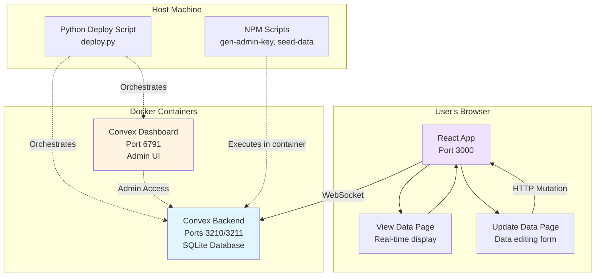
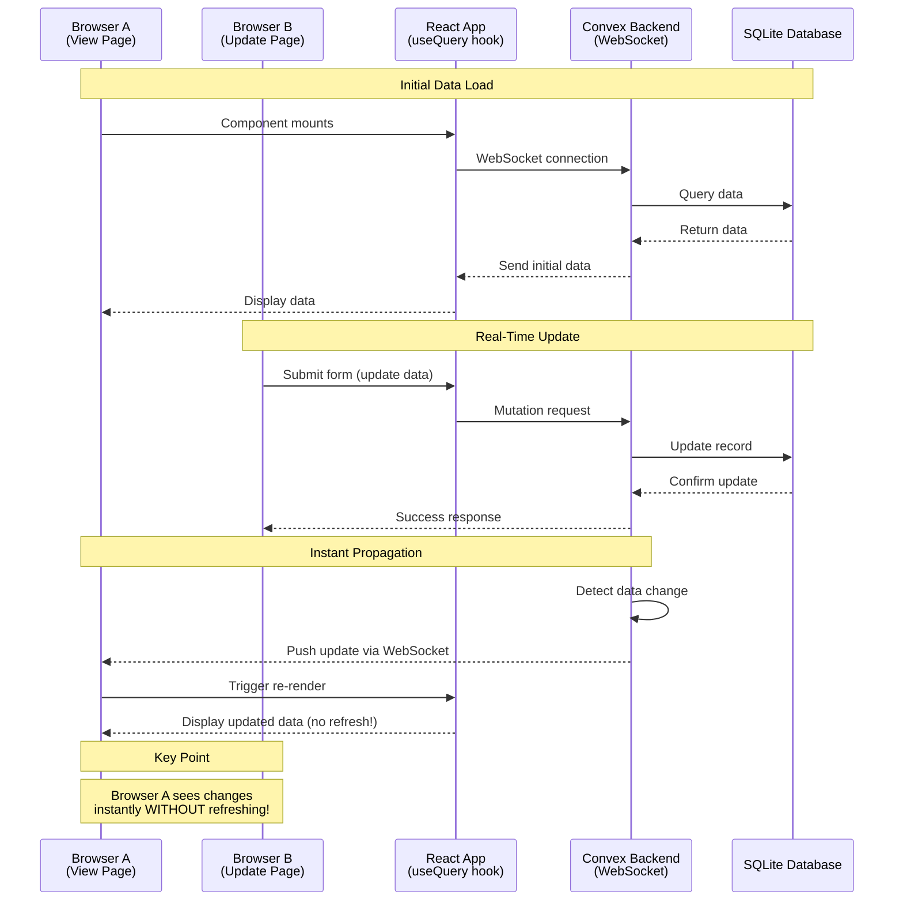

# ReactJS POC with Self-Hosted Convex Real-Time Sync

A proof-of-concept React application demonstrating real-time data synchronization using a self-hosted Convex database. When data is updated in one browser, changes automatically propagate to all other browsers viewing the same data—without requiring a page refresh!

## Features

- **Real-Time Data Sync**: Changes made in one browser instance instantly appear in all connected browsers
- **Two-Page Application**:
  - **View Data** - Read-only display of all data with real-time updates
  - **Update Data** - Form interface to modify existing data records
- **Self-Hosted Convex**: Complete control over your data with Docker-based deployment
- **Convex Dashboard**: Admin interface for database management and inspection
- **Type-Safe**: Built with TypeScript for robust code

## Architecture Overview



**What this diagram shows:**
- Your React app runs in the browser and connects to the Convex backend via WebSocket for real-time updates
- The Convex backend and Dashboard run in Docker containers on your machine
- The Python deploy script manages starting/stopping the Docker containers
- NPM scripts let you run commands inside the Docker containers from your host machine

## Real-Time Data Flow



**What this diagram shows:**
1. **Browser A** (View Page) subscribes to data via WebSocket and displays it
2. **Browser B** (Update Page) submits a form to update data
3. Convex updates the database and **automatically pushes the change to Browser A**
4. Browser A's React component re-renders instantly—no page refresh needed!

## Prerequisites

Before you begin, ensure you have the following installed:

- **Node.js** (v18 or higher) - [Download](https://nodejs.org/)
- **npm** (comes with Node.js)
- **Python 3** (v3.7 or higher) - [Download](https://www.python.org/)
- **Docker** - [Download](https://www.docker.com/products/docker-desktop/)
- **Docker Compose** (included with Docker Desktop)

Verify your installation:
```bash
node --version    # Should show v18+
npm --version     # Should show 9+
python3 --version # Should show 3.7+
docker --version  # Should show 20+
docker compose version  # Should show 2+
```

## Quick Start

### 1. Install Dependencies

```bash
npm install
```

### 2. Start Docker Services

```bash
python deploy.py up
```

This starts the Convex backend and Dashboard containers. You should see output indicating the services are starting.

### 3. Generate Admin Key

```bash
npm run gen-admin-key
```

This generates a secure admin key and saves it to your `.env` file. **You only need to do this once** (the first time you set up the project).

### 4. Create Your Environment File

Create a `.env` file in the project root (or copy from the example):

```bash
cp .env.example .env
```

Your `.env` file should look like this (after running `npm run gen-admin-key`, the admin key will be filled in):

```bash
CONVEX_SELF_HOSTED_URL=http://localhost:3210
CONVEX_SELF_HOSTED_ADMIN_KEY=0123456789abcdef...  # Generated by gen-admin-key
VITE_CONVEX_SELF_HOSTED_URL=http://localhost:3210
```

### 5. Seed Initial Data

```bash
npm run seed-data
```

This populates the database with sample mock data.

### 6. Start the React App

```bash
npm run dev
```

The app will be available at **http://localhost:3000**

### 7. Test Real-Time Sync

1. Open **http://localhost:3000/view** in Browser A
2. Open **http://localhost:3000/update** in Browser B
3. Update data in Browser B
4. Watch Browser A update **instantly**—no refresh needed!

---

## AI-Assisted Troubleshooting Guide

This section provides step-by-step instructions for working with an AI coding assistant (like Claude Code, GitHub Copilot, or ChatGPT) to troubleshoot and fix issues with this self-hosted Convex application.

### When to Use AI Troubleshooting

Use this guide when you encounter:
- Build or deployment failures
- Runtime errors in the browser console
- Functions not working or data not syncing
- Accessibility or styling issues

### Step-by-Step AI Instructions

#### Step 1: Start with the Deploy Command

**Prompt to AI:**
```
run python deploy.py up
```

**What to expect:** The AI will attempt to start all Docker services. If this fails, continue to Step 2.

---

#### Step 2: Investigate Build Failures

If the build fails, use this prompt:

**Prompt to AI:**
```
The Docker build failed. Please:
1. Check what error occurred
2. Read the Dockerfile to understand the build process
3. Fix any missing dependencies or files
4. Rebuild the frontend
```

**What to expect:** The AI will:
- Read the error messages
- Check if `package-lock.json` exists (run `npm install` if missing)
- Fix any TypeScript or build errors
- Rebuild with `docker compose up -d --build frontend`

---

#### Step 3: Test with Playwright

After services are running, verify the application works:

**Prompt to AI:**
```
Please test the application using Playwright:
1. Install Playwright: npm install -D playwright @playwright/test
2. Install Chromium: npx playwright install chromium
3. Create a test script that:
   - Opens http://localhost:3000/view
   - Captures console errors
   - Takes a screenshot
4. Run the test and report any errors
```

**What to expect:** The AI will create a test script, run it, and report any JavaScript errors or issues found.

---

#### Step 4: Fix Function Reference Errors

If you see `"[object Object] is not a functionReference"` error:

**Prompt to AI:**
```
I'm seeing a functionReference error in the browser console. Please:
1. Check the convex/_generated/api.ts file
2. Ensure function references use Symbol.for("functionName") as the key
3. Update the file and rebuild
```

**What to expect:** The AI will fix the function reference format and rebuild.

---

#### Step 5: Deploy Convex Functions

If functions are not found:

**Prompt to AI:**
```
The backend can't find the Convex functions. Please:
1. Check if .env file exists with CONVEX_SELF_HOSTED_ADMIN_KEY
2. Generate admin key if needed: docker compose exec backend ./generate_admin_key.sh
3. Copy functions from src/convex/ to convex/ folder
4. Deploy functions: npx convex deploy
```

**What to expect:** The AI will set up the environment and deploy the functions.

---

#### Step 6: Test Real-Time Sync

To verify everything works:

**Prompt to AI:**
```
Please create a Playwright test that demonstrates real-time sync:
1. Open Browser A at http://localhost:3000/view
2. Open Browser B at http://localhost:3000/update
3. In Browser B, create a new message
4. Verify Browser A receives the update automatically (no refresh)
5. Take screenshots and report results
```

**What to expect:** The AI will create a two-browser test and confirm real-time sync is working.

---

#### Step 7: Check Accessibility

If text is hard to see or invisible:

**Prompt to AI:**
```
The page has poor visibility. Please check:
1. Read src/index.css
2. Ensure text color contrasts well with background
3. Fix any white-on-white issues
4. Rebuild and verify with screenshot
```

**What to expect:** The AI will fix the CSS for proper contrast and accessibility.

---

### Common AI Prompts Reference

| Issue | Prompt to AI |
|-------|--------------|
| Build won't start | `run python deploy.py up and fix any errors` |
| Missing lock file | `run npm install to generate package-lock.json` |
| TypeScript errors | `check src/convex/_generated/ files and fix any issues` |
| Function not found | `deploy functions with npx convex deploy` |
| Console errors | `test with Playwright and capture browser console errors` |
| Can't see text | `fix CSS contrast in src/index.css for accessibility` |
| Real-time not working | `create two-browser Playwright test to verify sync` |

### Tips for Working with AI

1. **Be specific** - Tell the AI exactly what command to run first
2. **Let it read files** - AI needs to read files to understand the codebase
3. **Ask for verification** - Request screenshots or tests to confirm fixes
4. **Iterate if needed** - If first fix doesn't work, ask AI to try another approach
5. **Request explanation** - Ask AI to explain what it fixed and why

### Full Troubleshooting Session Example

**Starting Prompt:**
```
run python deploy.py up
```

**If AI reports errors, continue with:**
```
Please investigate and fix all issues. Then test with Playwright
to verify the application works correctly.
```

**Final verification:**
```
Test real-time sync with two browsers and confirm it's working.
```

---

## Environment Variables

Create a `.env` file in the project root with the following variables:

| Variable | Required | Description | Example |
|----------|----------|-------------|---------|
| `CONVEX_SELF_HOSTED_URL` | ✅ Yes | Backend API URL for server-side operations | `http://localhost:3210` |
| `CONVEX_SELF_HOSTED_ADMIN_KEY` | ✅ Yes | Admin key for backend operations (data import, schema management). Generate with `npm run gen-admin-key` | `0123456789abcdef...` |
| `VITE_CONVEX_SELF_HOSTED_URL` | ✅ Yes | Backend URL for client-side code (must be prefixed with `VITE_` for Vite to expose it to the browser) | `http://localhost:3210` |

**Important Notes:**
- The `.env` file is **not** committed to Git (see `.gitignore`)
- Never share your admin key or commit it to version control
- The `VITE_` prefix is required for client-side environment variables in Vite

## Project Structure

```
convex-poc/
├── src/
│   ├── convex/
│   │   ├── schema.ts         # Database schema definition
│   │   ├── functions.ts      # Query and mutation functions
│   │   └── _generated/       # Auto-generated type definitions
│   ├── pages/
│   │   ├── ViewData.tsx      # View data page (real-time display)
│   │   └── UpdateData.tsx    # Update data page (form interface)
│   ├── App.tsx               # Main app with routing
│   └── main.tsx              # Entry point (Convex client initialization)
├── docker-compose.yml        # Docker services configuration
├── deploy.py                 # Python orchestration script
├── generate-admin-key.sh     # Admin key generation script
├── seed-data.sh              # Data seeding script
├── seed-data.json            # Mock data for import
├── package.json              # NPM dependencies and scripts
├── vite.config.ts            # Vite configuration (port 3000)
├── .env.example              # Environment variable template
└── .env                      # Your actual environment variables (not in Git)
```

## Development Scripts

### NPM Scripts

| Command | Description |
|---------|-------------|
| `npm run dev` | Start the React development server on port 3000 |
| `npm run build` | Build the React app for production |
| `npm run preview` | Preview the production build locally |
| `npm run gen-admin-key` | Generate admin key (runs inside Docker container) |
| `npm run seed-data` | Seed database with mock data (runs inside Docker container) |

### Python Deploy Script

| Command | Description |
|---------|-------------|
| `python deploy.py up` | Start all Docker services (backend + dashboard) |
| `python deploy.py down` | Stop all Docker services |
| `python deploy.py restart` | Restart all Docker services |
| `python deploy.py status` | Check service status |
| `python deploy.py logs` | View service logs |
| `python deploy.py --help` | Show help message |

## Service URLs

After starting the services, access them at:

| Service | URL | Description |
|---------|-----|-------------|
| **React App** | http://localhost:3000 | Main application |
| **View Data Page** | http://localhost:3000/view | View all data with real-time updates |
| **Update Data Page** | http://localhost:3000/update | Update data records |
| **Convex Dashboard** | http://localhost:6791 | Admin interface for database management |
| **Convex Backend API** | http://localhost:3210 | Backend WebSocket/HTTP endpoint |

## How Real-Time Sync Works

The magic of real-time synchronization comes from how Convex combines three technologies:

1. **WebSocket Connection**: Your React app maintains an always-open connection to the Convex backend
2. **useQuery Hook**: The `useQuery` hook automatically subscribes to data changes
3. **Automatic Re-render**: When data changes, Convex pushes the update to all connected clients, triggering React to re-render

**Key Points:**
- No polling (the app doesn't repeatedly ask "has anything changed?")
- No manual refresh (users don't need to reload the page)
- Type-safe (TypeScript ensures data matches your schema)

## Troubleshooting

### Quick Fix Guide

If something isn't working, try these quick fixes in order:

| What's Wrong? | Quick Fix |
|---------------|-----------|
| Build fails with package-lock.json error | Run `npm install` |
| Browser shows functionReference error | Run `npx convex deploy` |
| Can't see text (white on white) | Run `docker compose up -d --build frontend` |
| Functions not found | Copy files: `cp src/convex/*.ts convex/` then `npx convex deploy` |
| Index name error | Rename `by_creation_time` to `by_created_at` in schema |
| Nothing works at all | Run `docker compose down && docker compose up -d --build` |

---

### Docker Build Fails - "npm ci" Error

**Problem:** The Docker build fails with an error about `package-lock.json` missing.

```
error The `npm ci` command can only install with an existing package-lock.json
```

**Solution:** You need to generate the lock file before building:

```bash
# Generate package-lock.json
npm install

# Then rebuild
python deploy.py up
```

**Why this happens:** The Docker build uses `npm ci` which is faster and more reliable than `npm install`, but it requires a lock file to exist first.

---

### TypeScript Build Errors

**Problem:** You see TypeScript errors about missing files or wrong types in `src/convex/_generated/`.

**Solution:** Delete the generated folder and rebuild:

```bash
# Remove the generated files
rm -rf src/convex/_generated convex/_generated

# Rebuild the frontend
docker compose up -d --build frontend
```

---

### "is not a functionReference" Error in Browser

**Problem:** You see this error in the browser console:

```
Error: [object Object] is not a functionReference
```

**Solution:** The functions need to be deployed to the Convex backend:

```bash
# 1. Make sure .env file exists with admin key
cat .env

# 2. Deploy functions
npx convex deploy

# 3. Refresh your browser
```

---

### Functions Not Found - "Could not find public function"

**Problem:** Browser error says functions don't exist after deploying.

**Solution:** Make sure your functions are in the correct location:

```bash
# Functions should be in convex/ folder at root, NOT src/convex/
ls convex/

# If functions.ts is not there, copy it:
cp src/convex/functions.ts convex/
cp src/convex/schema.ts convex/

# Then redeploy
npx convex deploy
```

---

### Schema Deployment Error - "IndexNameReserved"

**Problem:** You see an error about a reserved index name like `by_creation_time`.

**Solution:** Rename the index in your schema file (`convex/schema.ts`):

```typescript
// Change this:
.index("by_creation_time", ["createdAt"])

// To this:
.index("by_created_at", ["createdAt"])
```

Then redeploy with `npx convex deploy`.

---

### Can't See Text - White Text on White Background

**Problem:** The page loads but text is invisible (white text on white background).

**Solution:** Rebuild the frontend with updated CSS:

```bash
docker compose up -d --build frontend
```

Then hard refresh your browser (Ctrl+Shift+R or Cmd+Shift+R).

---

### Port 3000 Already in Use

If you see an error that port 3000 is in use, you can either:
1. Stop the other service using port 3000
2. Change the port in `vite.config.ts`:

```typescript
server: {
  port: 3001,  // Change to another port
  host: '0.0.0.0',
  strictPort: true
}
```

### Docker Containers Not Starting

If containers fail to start:

```bash
# Check Docker is running
docker ps

# Check container logs
docker compose logs backend
docker compose logs dashboard

# Restart containers
python deploy.py restart
```

### "Admin Key Not Set" Error

If you see an error about the admin key:

```bash
# Regenerate the admin key
npm run gen-admin-key

# Verify .env file has the admin key
cat .env
```

### Real-Time Updates Not Working

If changes don't appear instantly in other browsers:

1. Check browser console for errors (F12 → Console)
2. Verify Convex backend is healthy: `curl http://localhost:3210/health`
3. Check that both browsers are on the same page
4. Ensure WebSocket connection is established (browser DevTools → Network → WS tab)

### Data Lost After Container Restart

If data doesn't persist:

```bash
# Check Docker volume exists
docker volume ls | grep convex

# If volume is missing, recreate it
docker compose down -v
python deploy.py up
npm run seed-data
```

## Dashboard Usage

The Convex Dashboard at http://localhost:6791 provides a visual interface to:

- **View Data**: Browse all records in your database
- **Inspect Schema**: See your table definitions
- **Run Queries**: Execute custom queries against your data
- **Monitor Health**: Check backend status and connection stats

## Stopping the Application

To stop all services:

```bash
# Stop Docker services
python deploy.py down

# Stop the React dev server (Ctrl+C in the terminal)
```

## Security Notes

- **Never commit `.env`** to version control (it's in `.gitignore`)
- **Never share admin keys** publicly or in chat
- **Use different admin keys** for development and production
- **Rotate admin keys** periodically in production environments

## Technologies Used

| Component | Technology |
|-----------|------------|
| **Frontend Framework** | React 18 + TypeScript |
| **Build Tool** | Vite 5 |
| **Database** | Convex (self-hosted) with SQLite |
| **Orchestration** | Docker Compose |
| **Deployment Script** | Python 3 |
| **Routing** | React Router v7 |
| **Real-Time Communication** | WebSocket (via Convex client) |

## Resources

- [Convex Documentation](https://docs.convex.dev/)
- [Convex Self-Hosted Guide](https://github.com/get-convex/convex-backend/blob/main/self-hosted/README.md)
- [React Documentation](https://react.dev/)
- [Vite Documentation](https://vitejs.dev/)
- [Docker Documentation](https://docs.docker.com/)

## License

MIT License - feel free to use this project for learning and experimentation!
