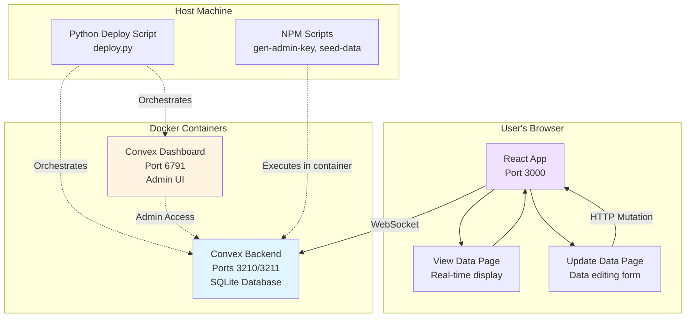
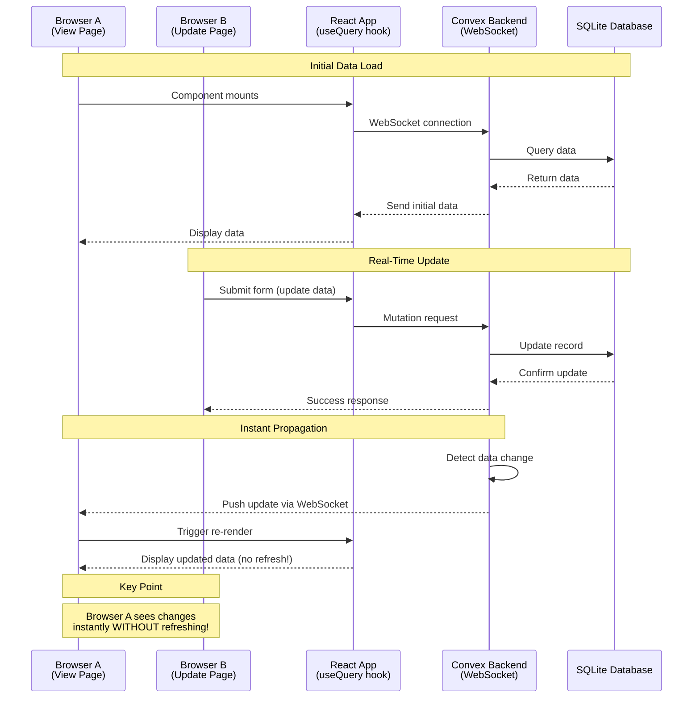

# ReactJS POC with Self-Hosted Convex Real-Time Sync

A proof-of-concept React application demonstrating real-time data synchronization using a self-hosted Convex database. When data is updated in one browser, changes automatically propagate to all other browsers viewing the same data—without requiring a page refresh!

## Features

- **Real-Time Data Sync**: Changes made in one browser instance instantly appear in all connected browsers
- **Two-Page Application**:
  - **View Data** - Read-only display of all data with real-time updates
  - **Update Data** - Form interface to modify existing data records
- **Self-Hosted Convex**: Complete control over your data with Docker-based deployment
- **Convex Dashboard**: Admin interface for database management and inspection
- **Type-Safe**: Built with TypeScript for robust code

## Architecture Overview



**What this diagram shows:**
- Your React app runs in the browser and connects to the Convex backend via WebSocket for real-time updates
- The Convex backend and Dashboard run in Docker containers on your machine
- The Python deploy script manages starting/stopping the Docker containers
- NPM scripts let you run commands inside the Docker containers from your host machine

## Real-Time Data Flow



**What this diagram shows:**
1. **Browser A** (View Page) subscribes to data via WebSocket and displays it
2. **Browser B** (Update Page) submits a form to update data
3. Convex updates the database and **automatically pushes the change to Browser A**
4. Browser A's React component re-renders instantly—no page refresh needed!

## Prerequisites

Before you begin, ensure you have the following installed:

- **Node.js** (v18 or higher) - [Download](https://nodejs.org/)
- **npm** (comes with Node.js)
- **Python 3** (v3.7 or higher) - [Download](https://www.python.org/)
- **Docker** - [Download](https://www.docker.com/products/docker-desktop/)
- **Docker Compose** (included with Docker Desktop)

Verify your installation:
```bash
node --version    # Should show v18+
npm --version     # Should show 9+
python3 --version # Should show 3.7+
docker --version  # Should show 20+
docker compose version  # Should show 2+
```

## Quick Start

### 1. Install Dependencies

```bash
npm install
```

### 2. Start Docker Services

```bash
python deploy.py up
```

This starts the Convex backend and Dashboard containers. You should see output indicating the services are starting.

### 3. Generate Admin Key

```bash
npm run gen-admin-key
```

This generates a secure admin key and saves it to your `.env` file. **You only need to do this once** (the first time you set up the project).

### 4. Create Your Environment File

Create a `.env` file in the project root (or copy from the example):

```bash
cp .env.example .env
```

Your `.env` file should look like this (after running `npm run gen-admin-key`, the admin key will be filled in):

```bash
CONVEX_SELF_HOSTED_URL=http://localhost:3210
CONVEX_SELF_HOSTED_ADMIN_KEY=0123456789abcdef...  # Generated by gen-admin-key
VITE_CONVEX_SELF_HOSTED_URL=http://localhost:3210
```

### 5. Seed Initial Data

```bash
npm run seed-data
```

This populates the database with sample mock data.

### 6. Start the React App

```bash
npm run dev
```

The app will be available at **http://localhost:3000**

### 7. Test Real-Time Sync

1. Open **http://localhost:3000/view** in Browser A
2. Open **http://localhost:3000/update** in Browser B
3. Update data in Browser B
4. Watch Browser A update **instantly**—no refresh needed!

## Environment Variables

Create a `.env` file in the project root with the following variables:

| Variable | Required | Description | Example |
|----------|----------|-------------|---------|
| `CONVEX_SELF_HOSTED_URL` | ✅ Yes | Backend API URL for server-side operations | `http://localhost:3210` |
| `CONVEX_SELF_HOSTED_ADMIN_KEY` | ✅ Yes | Admin key for backend operations (data import, schema management). Generate with `npm run gen-admin-key` | `0123456789abcdef...` |
| `VITE_CONVEX_SELF_HOSTED_URL` | ✅ Yes | Backend URL for client-side code (must be prefixed with `VITE_` for Vite to expose it to the browser) | `http://localhost:3210` |

**Important Notes:**
- The `.env` file is **not** committed to Git (see `.gitignore`)
- Never share your admin key or commit it to version control
- The `VITE_` prefix is required for client-side environment variables in Vite

## Project Structure

```
convex-poc/
├── src/
│   ├── convex/
│   │   ├── schema.ts         # Database schema definition
│   │   ├── functions.ts      # Query and mutation functions
│   │   └── _generated/       # Auto-generated type definitions
│   ├── pages/
│   │   ├── ViewData.tsx      # View data page (real-time display)
│   │   └── UpdateData.tsx    # Update data page (form interface)
│   ├── App.tsx               # Main app with routing
│   └── main.tsx              # Entry point (Convex client initialization)
├── docker-compose.yml        # Docker services configuration
├── deploy.py                 # Python orchestration script
├── generate-admin-key.sh     # Admin key generation script
├── seed-data.sh              # Data seeding script
├── seed-data.json            # Mock data for import
├── package.json              # NPM dependencies and scripts
├── vite.config.ts            # Vite configuration (port 3000)
├── .env.example              # Environment variable template
└── .env                      # Your actual environment variables (not in Git)
```

## Development Scripts

### NPM Scripts

| Command | Description |
|---------|-------------|
| `npm run dev` | Start the React development server on port 3000 |
| `npm run build` | Build the React app for production |
| `npm run preview` | Preview the production build locally |
| `npm run gen-admin-key` | Generate admin key (runs inside Docker container) |
| `npm run seed-data` | Seed database with mock data (runs inside Docker container) |

### Python Deploy Script

| Command | Description |
|---------|-------------|
| `python deploy.py up` | Start all Docker services (backend + dashboard) |
| `python deploy.py down` | Stop all Docker services |
| `python deploy.py restart` | Restart all Docker services |
| `python deploy.py status` | Check service status |
| `python deploy.py logs` | View service logs |
| `python deploy.py --help` | Show help message |

## Service URLs

After starting the services, access them at:

| Service | URL | Description |
|---------|-----|-------------|
| **React App** | http://localhost:3000 | Main application |
| **View Data Page** | http://localhost:3000/view | View all data with real-time updates |
| **Update Data Page** | http://localhost:3000/update | Update data records |
| **Convex Dashboard** | http://localhost:6791 | Admin interface for database management |
| **Convex Backend API** | http://localhost:3210 | Backend WebSocket/HTTP endpoint |

## How Real-Time Sync Works

The magic of real-time synchronization comes from how Convex combines three technologies:

1. **WebSocket Connection**: Your React app maintains an always-open connection to the Convex backend
2. **useQuery Hook**: The `useQuery` hook automatically subscribes to data changes
3. **Automatic Re-render**: When data changes, Convex pushes the update to all connected clients, triggering React to re-render

**Key Points:**
- No polling (the app doesn't repeatedly ask "has anything changed?")
- No manual refresh (users don't need to reload the page)
- Type-safe (TypeScript ensures data matches your schema)

## Troubleshooting

### Port 3000 Already in Use

If you see an error that port 3000 is in use, you can either:
1. Stop the other service using port 3000
2. Change the port in `vite.config.ts`:

```typescript
server: {
  port: 3001,  // Change to another port
  host: '0.0.0.0',
  strictPort: true
}
```

### Docker Containers Not Starting

If containers fail to start:

```bash
# Check Docker is running
docker ps

# Check container logs
docker compose logs backend
docker compose logs dashboard

# Restart containers
python deploy.py restart
```

### "Admin Key Not Set" Error

If you see an error about the admin key:

```bash
# Regenerate the admin key
npm run gen-admin-key

# Verify .env file has the admin key
cat .env
```

### Real-Time Updates Not Working

If changes don't appear instantly in other browsers:

1. Check browser console for errors (F12 → Console)
2. Verify Convex backend is healthy: `curl http://localhost:3210/health`
3. Check that both browsers are on the same page
4. Ensure WebSocket connection is established (browser DevTools → Network → WS tab)

### Data Lost After Container Restart

If data doesn't persist:

```bash
# Check Docker volume exists
docker volume ls | grep convex

# If volume is missing, recreate it
docker compose down -v
python deploy.py up
npm run seed-data
```

## Dashboard Usage

The Convex Dashboard at http://localhost:6791 provides a visual interface to:

- **View Data**: Browse all records in your database
- **Inspect Schema**: See your table definitions
- **Run Queries**: Execute custom queries against your data
- **Monitor Health**: Check backend status and connection stats

## Stopping the Application

To stop all services:

```bash
# Stop Docker services
python deploy.py down

# Stop the React dev server (Ctrl+C in the terminal)
```

## Security Notes

- **Never commit `.env`** to version control (it's in `.gitignore`)
- **Never share admin keys** publicly or in chat
- **Use different admin keys** for development and production
- **Rotate admin keys** periodically in production environments

## Technologies Used

| Component | Technology |
|-----------|------------|
| **Frontend Framework** | React 18 + TypeScript |
| **Build Tool** | Vite 5 |
| **Database** | Convex (self-hosted) with SQLite |
| **Orchestration** | Docker Compose |
| **Deployment Script** | Python 3 |
| **Routing** | React Router v7 |
| **Real-Time Communication** | WebSocket (via Convex client) |

## Resources

- [Convex Documentation](https://docs.convex.dev/)
- [Convex Self-Hosted Guide](https://github.com/get-convex/convex-backend/blob/main/self-hosted/README.md)
- [React Documentation](https://react.dev/)
- [Vite Documentation](https://vitejs.dev/)
- [Docker Documentation](https://docs.docker.com/)

## License

MIT License - feel free to use this project for learning and experimentation!
