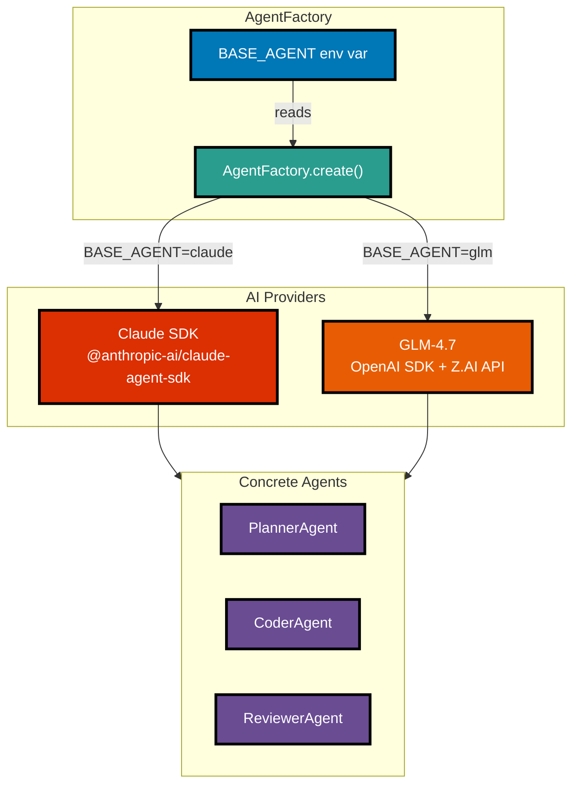
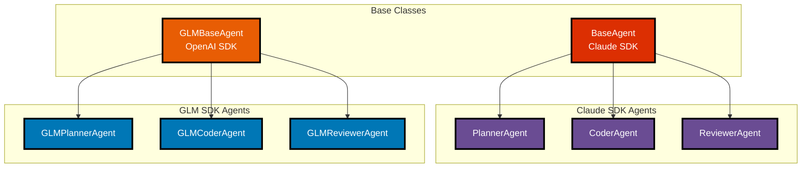

# Convex POC

> **Project Status: ✅ Complete** — A fully functional multi-agent orchestration system demonstrating reusable patterns for autonomous coding agents.

A proof-of-concept for building autonomous coding agents using multiple AI provider integrations (Anthropic Claude SDK and Z.AI GLM-4.7 via OpenAI SDK) with Convex for persistent state management. This project demonstrates multi-agent coordination patterns where specialized agents (Planner, Coder, Reviewer) collaborate to complete coding tasks autonomously.

## Provider Architecture



## Quick Start

See the complete multi-agent workflow demonstration in the [examples/](./examples/) directory. The email validation utility example shows how to execute a practical coding task through the full Planner→Coder→Reviewer pipeline.

[**Run the Example →](./examples/README.md)

## What This Project Demonstrates

This POC showcases a working multi-agent orchestration system with:

- **SequentialOrchestrator**: Coordinates a three-agent pipeline for autonomous coding tasks
- **Agent Specialization**: Distinct roles for Planner, Coder, and Reviewer agents
- **State Management**: Filesystem-based artifact passing for inspection and debugging
- **Optional Convex Integration**: Persistent state tracking for multi-session workflows
- **Clean Patterns**: Reusable TypeScript patterns for agent coordination
- **Comprehensive Testing**: 126+ passing tests with full type safety

### The Workflow

```mermaid
flowchart LR
    subgraph Input["Task Input"]
        TASK["User Task"]
    end

    subgraph Orchestrator["SequentialOrchestrator"]
        ORCH["Coordinate Workflow"]
    end

    subgraph Stage1["Stage 1: Planning"]
        PLAN_AGENT["PlannerAgent"]
        PLAN_ARTIFACT["plan.json<br/>PlanResult"]
    end

    subgraph Stage2["Stage 2: Coding"]
        CODE_AGENT["CoderAgent"]
        CODE_ARTIFACT["code.json<br/>CodeResult"]
    end

    subgraph Stage3["Stage 3: Review"]
        REVIEW_AGENT["ReviewerAgent"]
        REVIEW_ARTIFACT["review.json<br/>ReviewResult"]
    end

    subgraph Output["Final Output"]
        RESULT["Workflow Result<br/>✓ Complete"]
    end

    TASK --> ORCH
    ORCH --> PLAN_AGENT
    PLAN_AGENT --> PLAN_ARTIFACT
    PLAN_ARTIFACT --> CODE_AGENT
    CODE_AGENT --> CODE_ARTIFACT
    CODE_ARTIFACT --> REVIEW_AGENT
    REVIEW_AGENT --> REVIEW_ARTIFACT
    REVIEW_ARTIFACT --> RESULT

    style TASK fill:#2B2D42,stroke:#000,stroke-width:3px,color:#fff
    style ORCH fill:#2A9D8F,stroke:#000,stroke-width:3px,color:#fff
    style PLAN_AGENT fill:#DC2F02,stroke:#000,stroke-width:3px,color:#fff
    style PLAN_ARTIFACT fill:#0077B6,stroke:#000,stroke-width:3px,color:#fff
    style CODE_AGENT fill:#E85D04,stroke:#000,stroke-width:3px,color:#fff
    style CODE_ARTIFACT fill:#0077B6,stroke:#000,stroke-width:3px,color:#fff
    style REVIEW_AGENT fill:#6A4C93,stroke:#000,stroke-width:3px,color:#fff
    style REVIEW_ARTIFACT fill:#0077B6,stroke:#000,stroke-width:3px,color:#fff
    style RESULT fill:#2A9D8F,stroke:#000,stroke-width:3px,color:#fff
```



Each agent produces a JSON artifact that can be inspected for debugging and validation:
- **plan.json** - Task decomposition with execution steps
- **code.json** - File changes and implementation details
- **review.json** - Validation feedback with issues and approval status

### Provider-Specific Agent Implementations



## What Was Built

This POC delivered a complete multi-agent orchestration system:

**Core Components:**
- Multi-agent orchestration system (Planner → Coder → Reviewer pipeline)
- SequentialOrchestrator for workflow coordination and state management
- Three specialized agents with typed interfaces (PlanResult, CodeResult, ReviewResult)
- Filesystem-based state passing for inspection and debugging
- Comprehensive examples with verification utilities
- 159+ passing tests with full type safety

**Provider Support:**
- Dual provider architecture (Claude SDK + GLM-4.7 via OpenAI SDK)
- AgentFactory for environment-based provider selection
- Per-agent provider override capability
- GLM-specific agent implementations (GLMPlannerAgent, GLMCoderAgent, GLMReviewerAgent)

**Patterns Established:**
- BaseAgent abstract class with SDK hooks for Convex integration
- GLMBaseAgent abstract class for OpenAI SDK integration
- Sequential orchestration with filesystem artifact passing
- Agent specialization with typed result interfaces
- Factory pattern for provider abstraction
- Optional Convex workflow tracking for persistence

**Learning Outcomes:**
- Proven patterns for multi-agent coordination
- Clean separation between orchestration and agent logic
- Type-safe artifact validation and verification
- Resilient error handling with continueOnError flag

**Note on Convex Integration:**
The Convex backend was fully designed (schema, helpers, SDK hooks) but not deployed for this POC. The placeholder in `src/convex/client.ts` is intentional—see the header comment for details. The patterns established support full Convex integration when needed.

## Example Task: Email Validation Utility

The demonstration example (in [examples/real-example.ts](./examples/real-example.ts)) executes a practical task through the multi-agent workflow:

**Task**: Create a TypeScript utility function for validating email addresses with regex

**What it demonstrates**:
- Concrete task definition with clear requirements
- Sequential workflow execution through all three agents
- Artifact inspection and verification utilities
- Expected output structure for each agent

**Features**:
- Agent collaboration and handoff patterns
- Filesystem-based state passing
- Error boundaries with continueOnError flag
- Optional Convex workflow tracking

**To run**: See the complete guide in [examples/README.md](./examples/README.md)

## Project Structure

```
convex-poc/
├── src/
│   ├── agents/              # Agent implementations (Planner, Coder, Reviewer)
│   ├── orchestrator/        # SequentialOrchestrator and state management
│   └── types/              # TypeScript type definitions
├── examples/               # Workflow demonstrations
│   ├── real-example.ts     # Complete email validation example
│   ├── verify-output.ts    # Artifact validation utilities
│   ├── expected-artifacts/ # Example output structures
│   └── README.md           # Detailed execution guide
└── .planning/              # Project planning and phase documentation
```

## Technical Stack

- **TypeScript/Node** - Primary development environment
- **Claude Agent SDK** - Anthropic Claude integration (default provider)
- **OpenAI SDK** - Z.AI GLM-4.7 integration (alternative provider)
- **Convex** - Optional persistent state management (self-hosted via Docker)
- **SequentialOrchestrator** - Multi-agent coordination pattern
- **AgentFactory** - Environment-based provider selection

## Provider Selection

The project supports two AI providers via the `BASE_AGENT` environment variable:

| Provider | BASE_AGENT Value | Model | Description |
|----------|------------------|-------|-------------|
| **Claude SDK** | `claude` (default) | sonnet, opus, haiku | Anthropic's Claude Agent SDK with hooks |
| **GLM-4.7** | `glm` | glm-4.7 | Z.AI's model via OpenAI SDK with thinking mode |

### Configuration

```bash
# .env
# Default: Uses Claude SDK
BASE_AGENT=claude

# Alternative: Uses GLM-4.7
BASE_AGENT=glm
ZAI_API_KEY=your-zai-api-key
```

### Factory Pattern

```typescript
import { AgentFactory } from './agents';

// Uses BASE_AGENT env var (defaults to "claude")
const coder = AgentFactory.createCoder({ agentType: "coder" });

// Override provider per agent
const glmPlanner = AgentFactory.createPlanner({
  agentType: "planner",
  provider: "glm"
});
```

## Documentation

- **Pattern Guide**: [.planning/PATTERNS.md](./.planning/PATTERNS.md) — Reusable multi-agent coordination patterns
- **Setup Guide**: [docs/SETUP_GUIDE.md](./docs/SETUP_GUIDE.md) — Convex + Z.AI integration setup
- **GLM-4.7 Integration**: [docs/GLM-4.7_INTEGRATION_RESEARCH.md](./docs/GLM-4.7_INTEGRATION_RESEARCH.md) — GLM provider research
- **Examples & Tutorials**: [examples/README.md](./examples/README.md)
- **Project Context**: [.planning/PROJECT.md](./.planning/PROJECT.md)
- **Completion Summary**: [.planning/COMPLETION.md](./.planning/COMPLETION.md)
- **Development Roadmap**: [.planning/ROADMAP.md](./.planning/ROADMAP.md)

## Prerequisites

- Node.js (v18 or higher)
- Anthropic API key from [console.anthropic.com](https://console.anthropic.com/) (for Claude provider)
- Z.AI API key from [platform.z.ai](https://platform.z.ai/) (for GLM provider)
- (Optional) Convex backend for state tracking

### API Key Setup

```bash
# For Claude SDK (default)
ANTHROPIC_API_KEY=your-anthropic-key

# For GLM-4.7
ZAI_API_KEY=your-zai-api-key
```

## Installation

```bash
# Clone the repository
git clone <repository-url>
cd convex-poc

# Install dependencies
npm install

# Build the project
npm run build
```

## License

MIT
