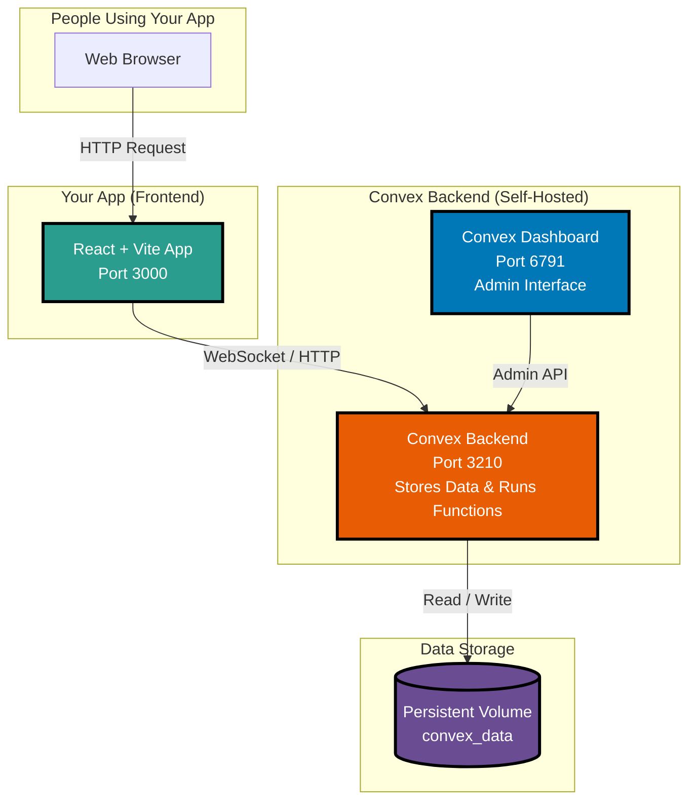

# Self-Hosted Convex Setup Guide

## What is Self-Hosted Convex?

**Convex** is a reactive database and backend platform. By default, Convex hosts your application on their cloud service. **Self-hosting** means running Convex on your own hardware (like your computer, a private server, or a cloud provider you control) instead of using Convex's hosted service.

### Analogy: Think of it like email
- **Hosted Convex** = Using Gmail (Google manages everything for you)
- **Self-Hosted Convex** = Running your own email server (you manage everything)

---

## Architecture Overview



### What Each Component Does

| Component | What It Does | Port |
|-----------|--------------|------|
| **Frontend** | Your React app that users see in their browser | 3000 |
| **Backend** | The "brain" - stores data, runs functions, handles real-time updates | 3210 |
| **Dashboard** | A visual tool to view your data, logs, and run functions | 6791 |
| **Volume** | Where data is saved permanently (survives container restarts) | N/A |

---

## Setup Flow Diagram

```mermaid
flowchart LR
    A[Start] --> B[Run docker compose up -d]
    B --> C[Wait for Backend to be Healthy]
    C --> D[Generate Admin Key<br/>docker compose exec backend ./generate_admin_key.sh]
    D --> E[Copy the Generated Admin Key]
    E --> F[Set Environment Variable<br/>CONVEX_SELF_HOSTED_ADMIN_KEY]
    F --> G[Restart Containers<br/>docker compose restart]
    G --> H[Access Dashboard<br/>http://localhost:6791]
    H --> I[Login with Admin Key]
    I --> J[Deploy Your Code<br/>npx convex deploy]
    J --> K[Ready to Use!]

    style A fill:#2B2D42,stroke:#000,stroke-width:3px,color:#fff
    style B fill:#2B2D42,stroke:#000,stroke-width:3px,color:#fff
    style C fill:#2B2D42,stroke:#000,stroke-width:3px,color:#fff
    style D fill:#E85D04,stroke:#000,stroke-width:3px,color:#fff
    style E fill:#2B2D42,stroke:#000,stroke-width:3px,color:#fff
    style F fill:#DC2F02,stroke:#000,stroke-width:3px,color:#fff
    style G fill:#2B2D42,stroke:#000,stroke-width:3px,color:#fff
    style H fill:#2B2D42,stroke:#000,stroke-width:3px,color:#fff
    style I fill:#0077B6,stroke:#000,stroke-width:3px,color:#fff
    style J fill:#2B2D42,stroke:#000,stroke-width:3px,color:#fff
    style K fill:#2A9D8F,stroke:#000,stroke-width:3px,color:#fff
```



---

## Step-by-Step Setup Guide

### Prerequisites

- **Docker** installed on your machine
- **Docker Compose** installed (comes with Docker Desktop)
- A **Convex project** (create one with `npx create convex@latest`)

---

### Step 1: Start the Containers

Run this command to start all Convex services:

```bash
docker compose up -d
```

**What this does:**
- Downloads the Convex Docker images (if not already downloaded)
- Creates a network so containers can talk to each other
- Creates a volume to store data permanently
- Starts the backend, dashboard, and your frontend

---

### Step 2: Wait for Backend to be Healthy

The backend needs a few seconds to initialize. Check that it's ready:

```bash
docker compose ps
```

You should see the backend status as **healthy**:

```
NAME              STATUS
convex-backend    Up X seconds (healthy)
convex-dashboard  Up X seconds
convex-frontend   Up X seconds
```

---

### Step 3: Generate the Admin Key

**This is the most important step!** The admin key is like a master password that lets you:
- Log into the Dashboard
- Deploy code from your machine
- Run administrative commands

Run this command:

```bash
docker compose exec backend ./generate_admin_key.sh
```

**Example output:**
```
convex-poc|017ee86485eac64247ddb003f350f3c80cc206cc096f7e20523224686ee32beb6ff05d1a41
Admin key:
```

**Copy this entire key!** You'll need it for the next step.

---

### Step 4: Set the Admin Key Environment Variable

Now you need to tell Docker to use this admin key.

**Option A: Set it in your shell (temporary)**

```bash
export CONVEX_SELF_HOSTED_ADMIN_KEY="convex-poc|017ee86485eac64247ddb003f350f3c80cc206cc096f7e20523224686ee32beb6ff05d1a41"
```

**Option B: Create a `.env` file (recommended - permanent)**

Create a file named `.env` in the same directory as your `docker-compose.yml`:

```bash
# Convex Self-Hosted Configuration
CONVEX_SELF_HOSTED_ADMIN_KEY=convex-poc|017ee86485eac64247ddb003f350f3c80cc206cc096f7e20523224686ee32beb6ff05d1a41

# Optional: Configure where your backend is hosted
CONVEX_CLOUD_ORIGIN=http://127.0.0.1:3210
CONVEX_SITE_ORIGIN=http://127.0.0.1:3211
```

---

### Step 5: Restart Containers with the New Key

```bash
docker compose down
docker compose up -d
```

The warning about `CONVEX_SELF_HOSTED_ADMIN_KEY` should now be gone!

---

### Step 6: Access the Dashboard

Open your browser and go to:

**http://localhost:6791**

You'll be prompted to enter your admin key. Paste the key you generated in Step 3.

---

### Step 7: Deploy Your Code

Once the dashboard is accessible, you can deploy your Convex functions:

```bash
# Set your environment variables
export CONVEX_SELF_HOSTED_URL="http://127.0.0.1:3210"
export CONVEX_SELF_HOSTED_ADMIN_KEY="your-admin-key-here"

# Deploy your functions
npx convex deploy
```

---

## Environment Variables Explained

| Variable | What It Does | Example |
|----------|--------------|---------|
| `CONVEX_SELF_HOSTED_ADMIN_KEY` | Master password for dashboard and deployments | `convex-poc|017ee...` |
| `CONVEX_SELF_HOSTED_URL` | Where your backend is running | `http://127.0.0.1:3210` |
| `CONVEX_CLOUD_ORIGIN` | Backend API address (internal use) | `http://127.0.0.1:3210` |
| `CONVEX_SITE_ORIGIN` | HTTP action endpoints address | `http://127.0.0.1:3211` |

---

## Common Commands

```bash
# Start all services
docker compose up -d

# Stop all services
docker compose down

# Stop and remove all data (fresh start)
docker compose down -v

# View logs
docker compose logs -f backend

# Check container status
docker compose ps

# Generate a new admin key
docker compose exec backend ./generate_admin_key.sh

# Restart backend only
docker compose restart backend
```

---

## Troubleshooting

### Issue: "CONVEX_SELF_HOSTED_ADMIN_KEY not set" warning

**Solution:** You didn't set the environment variable. Follow Step 4.

### Issue: Dashboard won't load

**Solution:** Check that the backend is healthy:
```bash
docker compose ps
```

### Issue: Can't deploy code

**Solution:** Make sure you have these environment variables set locally:
```bash
export CONVEX_SELF_HOSTED_URL="http://127.0.0.1:3210"
export CONVEX_SELF_HOSTED_ADMIN_KEY="your-admin-key-here"
```

### Issue: Data is lost when restarting

**Solution:** Don't use `docker compose down -v` in production. The `-v` flag deletes your data volume.

---

## Security Best Practices

1. **Never commit your admin key to Git**
   - Add `.env` to your `.gitignore` file

2. **Use different keys for different environments**
   - Generate a new key for production vs development

3. **Keep your admin key secret**
   - Anyone with the admin key has full access to your backend

4. **Use strong instance names**
   - The instance name is part of your key (e.g., `convex-poc|...`)

---

## Quick Reference Card

```
┌─────────────────────────────────────────────────────────────────┐
│                    SELF-HOSTED CONVEX                           │
├─────────────────────────────────────────────────────────────────┤
│ 1. Start:     docker compose up -d                             │
│ 2. Generate:  docker compose exec backend ./generate_admin_key  │
│ 3. Set Key:   export CONVEX_SELF_HOSTED_ADMIN_KEY="..."         │
│ 4. Restart:   docker compose down && docker compose up -d       │
│ 5. Dashboard: http://localhost:6791                             │
│ 6. Deploy:    npx convex deploy                                 │
├─────────────────────────────────────────────────────────────────┤
│  Ports:  Backend=3210  Dashboard=6791  Frontend=3000           │
└─────────────────────────────────────────────────────────────────┘
```

---

## Additional Resources

- [Official Convex Self-Hosting Guide](https://stack.convex.dev/self-hosted-develop-and-deploy)
- [Convex Backend GitHub](https://github.com/get-convex/convex-backend)
- [Convex Documentation](https://docs.convex.dev)

---

## Summary

Self-hosting Convex gives you full control over your data and infrastructure. The key steps are:

1. **Start** the Docker containers
2. **Generate** an admin key using the provided script
3. **Configure** your environment with the key
4. **Access** the dashboard at http://localhost:6791
5. **Deploy** your code using the Convex CLI

Think of the **admin key** as your master key - guard it well and you'll have full control of your self-hosted Convex instance!
