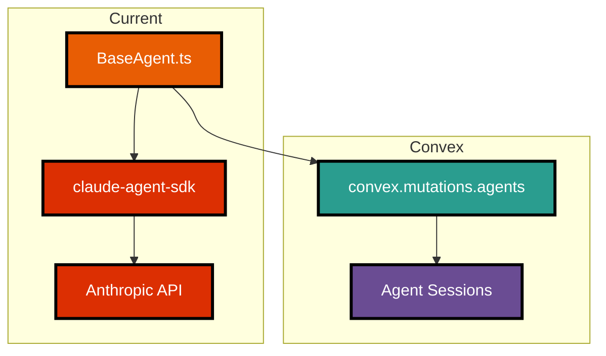
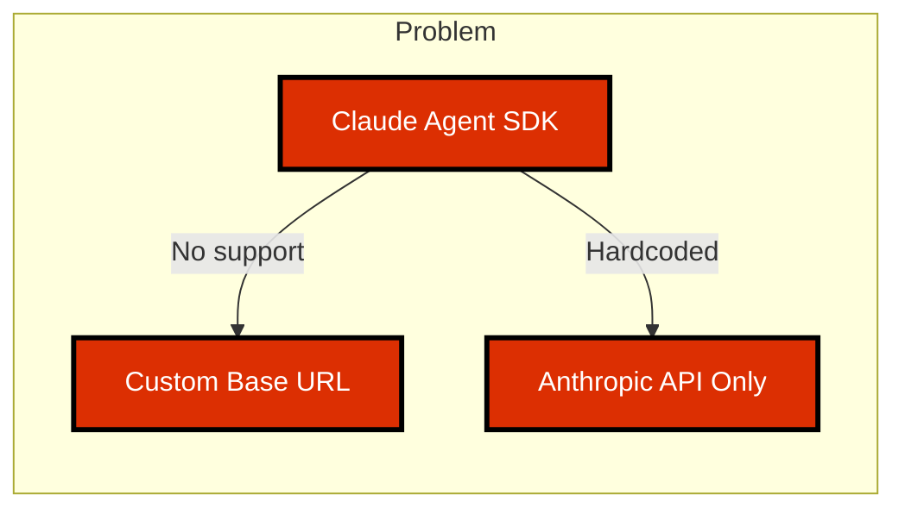
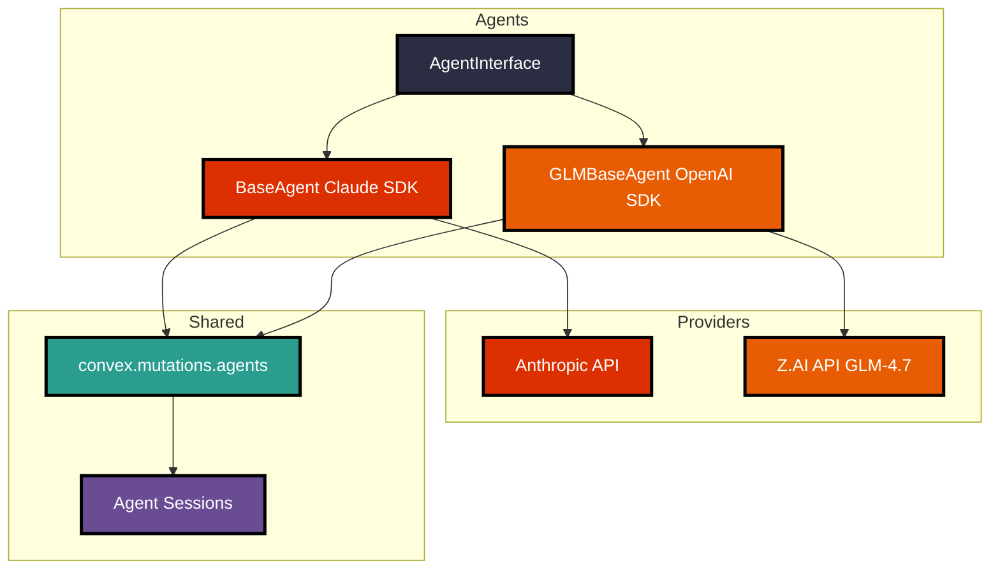
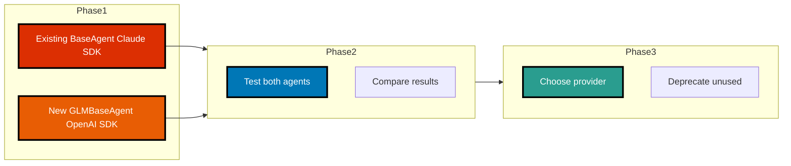

# GLM-4.7 Integration Research for BaseAgent

**Date:** 2026-01-17
**Status:** Research Complete

---

## Problem Statement

The current `BaseAgent.ts` uses **Anthropic's Claude Agent SDK** (`@anthropic-ai/claude-agent-sdk`), but we want to use **GLM-4.7 from Z.AI** instead.

---

## Current Architecture



**Current Dependencies:**
- `@anthropic-ai/claude-agent-sdk` - Anthropic's agent framework
- Uses `query()` function with hooks (SessionStart, SessionEnd)
- Model defaults to `"sonnet"`

---

## GLM-4.7 API Capabilities

### Key Features

| Feature | GLM-4.7 | Notes |
|---------|---------|-------|
| **OpenAI Compatible** | ✓ | Can use standard `openai` npm package |
| **Base URL** | `https://api.z.ai/api/paas/v4/` | Custom baseURL required |
| **Model Name** | `glm-4.7` | Primary model identifier |
| **Streaming** | ✓ | `stream: true` supported |
| **Thinking Mode** | ✓ | `thinking: { type: "enabled" }` for reasoning |
| **Chat Completions** | ✓ | Standard OpenAI format |

### API Example (TypeScript)

```typescript
import OpenAI from "openai";

const client = new OpenAI({
  apiKey: process.env.ZAI_API_KEY,
  baseURL: "https://api.z.ai/api/paas/v4/",
});

const completion = await client.chat.completions.create({
  model: "glm-4.7",
  messages: [
    { role: "system", content: "You are a helpful assistant" },
    { role: "user", content: "Write code for..." }
  ],
  thinking: { type: "enabled" },  // GLM-4.7 specific
  stream: true,  // Streaming supported
});

// Handle streaming response
for await (const chunk of completion) {
  console.log(chunk.choices[0]?.delta?.content || "");
}
```

---

## Integration Challenge

### Why Claude SDK Won't Work with GLM-4.7



**The Issue:**
- Claude Agent SDK is **hardcoded** for Anthropic's API
- No option to specify custom `baseURL`
- Cannot be adapted to work with Z.AI's OpenAI-compatible endpoint

**Solution:** Create a new BaseAgent implementation using the OpenAI SDK directly.

---

## Proposed Solution

### Option A: New GLMBaseAgent Class (Recommended)



**Advantages:**
- ✓ Keep existing BaseAgent for Claude compatibility
- ✓ GLMBaseAgent mirrors BaseAgent pattern
- ✓ Same Convex integration (sessions, workflows)
- ✓ Easy to switch between providers
- ✓ Can add more providers later (Gemini, local models)

---

## Implementation Plan

### Step 1: Create Agent Interface

```typescript
// src/types/agent.ts
export interface AgentInterface {
  execute(input: string): Promise<string>;
  getSessionId(): Id<"agentSessions"> | null;
}
```

### Step 2: Extract Shared Convex Logic

```typescript
// src/agents/ConvexAgentMixin.ts
export abstract class ConvexAgentMixin implements AgentInterface {
  protected sessionId: Id<"agentSessions"> | null = null;
  protected readonly workflowId?: Id<"workflows">;

  // Shared session management
  protected async createSession(agentType: string, input: string) { }
  protected async updateSession(output: string, status: string) { }
}
```

### Step 3: Create GLMBaseAgent

```typescript
// src/agents/GLMBaseAgent.ts
import OpenAI from "openai";

export abstract class GLMBaseAgent extends ConvexAgentMixin {
  private client: OpenAI;

  constructor(config: AgentConfig) {
    super(config);
    this.client = new OpenAI({
      apiKey: process.env.ZAI_API_KEY,
      baseURL: "https://api.z.ai/api/paas/v4/",
    });
  }

  protected abstract getSystemPrompt(): string;

  public async execute(input: string): Promise<string> {
    // Create session
    await this.createSession(this.agentType, input);

    // Call GLM-4.7
    const stream = await this.client.chat.completions.create({
      model: "glm-4.7",
      messages: [
        { role: "system", content: this.getSystemPrompt() },
        { role: "user", content: input }
      ],
      thinking: { type: "enabled" },
      stream: true,
    });

    // Collect response
    let output = "";
    for await (const chunk of stream) {
      output += chunk.choices[0]?.delta?.content || "";
    }

    // Update session
    await this.updateSession(output, "completed");

    return output;
  }
}
```

### Step 4: Example GLM Agent Implementation

```typescript
// src/agents/GLMCoderAgent.ts
export class GLMCoderAgent extends GLMBaseAgent {
  protected getSystemPrompt(): string {
    return "You are an expert TypeScript developer...";
  }
}

// Usage
const agent = new GLMCoderAgent({
  agentType: "glm-coder",
  workflowId: workflowId,
});

const code = await agent.execute("Write a function to validate emails");
```

---

## Comparison: Claude SDK vs OpenAI SDK for GLM-4.7

| Feature | Claude SDK | OpenAI SDK + GLM-4.7 |
|---------|-----------|---------------------|
| **Provider** | Anthropic | Z.AI |
| **Model** | sonnet, opus, haiku | glm-4.7 |
| **Streaming** | ✓ (via async generator) | ✓ (via async generator) |
| **Hooks** | ✓ (SessionStart, SessionEnd) | ✗ (manual implementation) |
| **Base URL** | Hardcoded | Configurable |
| **Thinking Mode** | ✗ | ✓ (`thinking: { type: "enabled" }`) |
| **Cost** | $3-15/million tokens | ~$3/month unlimited* |

**Note:** GLM-4.7 pricing model is different - flat monthly fee vs per-token pricing.

---

## Migration Path



**Steps:**
1. Create GLMBaseAgent alongside existing BaseAgent
2. Test both with same inputs
3. Compare quality, speed, cost
4. Gradually migrate agent implementations
5. Keep BaseAgent for Claude fallback

---

## File Structure

```
src/agents/
├── BaseAgent.ts              # Existing: Claude SDK implementation
├── GLMBaseAgent.ts           # NEW: GLM-4.7 implementation
├── ConvexAgentMixin.ts       # NEW: Shared Convex logic
├── interfaces/
│   └── AgentInterface.ts     # NEW: Common agent interface
├── ClaudeAgent.ts            # NEW: Rename/extract BaseAgent
└── implementations/
    ├── PlannerAgent.ts       # Can use either Claude or GLM
    ├── CoderAgent.ts         # Can use either Claude or GLM
    └── ReviewerAgent.ts      # Can use either Claude or GLM
```

---

## Environment Variables

```bash
# .env
# Agent provider selection (claude or glm)
# Default: claude
BASE_AGENT=glm

# Z.AI API (required for GLM provider)
ZAI_API_KEY=your-zai-api-key

# Anthropic API (required for claude provider)
ANTHROPIC_API_KEY=your-claude-key
```

---

## Implementation Status

**Status: ✅ COMPLETE** (Implemented 2026-01-17)

### What Was Implemented

1. **GLM Agent Classes** - Created GLM versions of all concrete agents:
   - `GLMCoderAgent` - Code generation using GLM-4.7
   - `GLMPlannerAgent` - Task planning using GLM-4.7
   - `GLMReviewerAgent` - Code review using GLM-4.7

2. **AgentFactory** - Factory pattern for provider selection:
   - Reads `BASE_AGENT` environment variable
   - Creates appropriate agent instances (Claude or GLM)
   - Supports per-config provider override

3. **SequentialOrchestrator Integration** - Updated to use AgentFactory:
   - All agents now respect BASE_AGENT setting
   - No code changes needed to switch providers

4. **Type Definitions** - Added `AgentProvider` type:
   - `"claude"` - Anthropic Claude SDK
   - `"glm"` - Z.AI GLM-4.7 via OpenAI SDK

5. **Documentation Updates**:
   - `.env.example` - Added BASE_AGENT configuration
   - `docs/SETUP_GUIDE.md` - Added provider selection guide

### File Structure

```
src/agents/
├── BaseAgent.ts              # Claude SDK implementation
├── GLMBaseAgent.ts           # GLM-4.7 implementation ✅
├── AgentFactory.ts           # Factory for provider selection ✅
├── CoderAgent.ts             # Claude coder
├── GLMCoderAgent.ts          # GLM coder ✅
├── PlannerAgent.ts           # Claude planner
├── GLMPlannerAgent.ts        # GLM planner ✅
├── ReviewerAgent.ts          # Claude reviewer
├── GLMReviewerAgent.ts       # GLM reviewer ✅
└── index.ts                  # Updated exports ✅
```

### Usage Examples

```typescript
// Use BASE_AGENT env var (defaults to "claude")
const planner = AgentFactory.createPlanner({ agentType: "planner" });
const coder = AgentFactory.createCoder({ agentType: "coder" });
const reviewer = AgentFactory.createReviewer({ agentType: "reviewer" });

// Override provider for specific agent
const glmCoder = AgentFactory.createCoder({
  agentType: "coder",
  provider: "glm"  // Always use GLM-4.7
});

// Direct instantiation still works
const directGLM = new GLMCoderAgent({ agentType: "glm-coder" });
```

---

## References

- [GLM-4.7 Documentation](https://docs.z.ai/guides/llm/glm-4.7)
- [Z.AI API Quick Start](https://docs.z.ai/guides/overview/quick-start)
- [OpenAI SDK TypeScript](https://github.com/openai/openai-node)
- [Existing: BaseAgent.ts](../src/agents/BaseAgent.ts)

---

**Research Completed By:** Claude (AI Assistant)
**Date:** 2026-01-17
