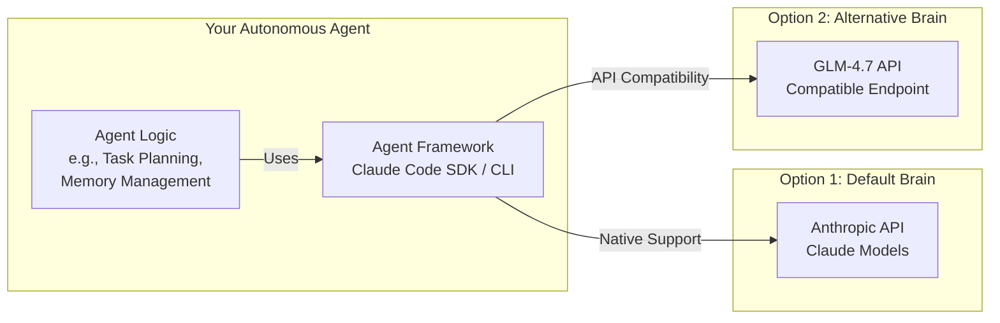

Your question touches on a nuanced but important distinction in how AI agents are built and how different models can be integrated. Let's break it down clearly, focusing on your goal of building autonomous coding agents.

### 🧠 The Core Idea: "Brain" vs. "Body"

Think of your autonomous coding agent as having two main parts:

1.  **The "Brain" (The Model)**: This is the AI model that does the thinking, reasoning, and understanding. Examples include **Claude**, **GPT-4**, and **GLM-4.7**.
2.  **The "Body" (The Agent Framework)**: This is the software that enables the "Brain" to interact with the world. It handles things like:
    *   **Tool Use**: The ability to call functions, run terminal commands, read/write files, search the web, etc.
    *   **Memory Management**: Keeping track of conversation history, project context, and long-term goals.
    *   **Task Planning**: Breaking down a complex goal (like "fix this bug") into a sequence of smaller steps.

**Claude Code CLI** and the **Agent SDK** are powerful **"Bodies"**. They provide the sophisticated framework for an AI agent to operate effectively as a coding assistant.

The key insight is: **A "Body" (Agent Framework) can, in principle, be driven by different "Brains" (AI Models)**, provided the communication interface is compatible.

---

### 🔌 How GLM-4.7 Connects to the Claude Code "Body"

The exciting news is that **GLM-4.7 has designed its API to be compatible with the interface expected by the Claude Code CLI and the Agent SDK**. This means you can, in effect, "swap the brain" without rebuilding the body.

This compatibility is achieved through API endpoint emulation. GLM-4.7 exposes an API that mimics the format and behavior of Anthropic's API, allowing the Claude Code CLI to communicate with it almost seamlessly.

Here’s a conceptual diagram of how this works:



So, to answer your questions directly:

1.  **"Can GLM-4.7 natively work with claude-code CLI?"**
    **Yes, it can.** You configure the Claude Code CLI to point to GLM-4.7's compatible API endpoint instead of Anthropic's. From the CLI's perspective, it's just talking to a different API that looks and behaves like the one it expects. This is a well-documented and practiced approach 【turn0search8】【turn0search9】【turn0search18】.

2.  **"Is it a different case?"**
    It's **not a fundamentally different case**, but rather a powerful example of how agent frameworks can be model-agnostic if the APIs are compatible. The "case" is using a **non-Anthropic model** to drive an **Anthropic-designed agent framework**. The compatibility layer makes this work.

3.  **"Can we use claude-code CLI as the brain for all of agents?"**
    **No, this is a crucial distinction.** The Claude Code CLI (and the Agent SDK) is the **"Body"**, not the **"Brain"**. You cannot use it *as* the brain. Instead, you use it *as* the powerful body that **can be driven by different brains**.

    *   **For Claude Models**: You use Claude Code CLI/SDK with Anthropic's API (the native brain).
    *   **For GLM-4.7**: You use Claude Code CLI/SDK with GLM-4.7's compatible API (an alternative brain).
    *   **For Other Models**: You would need that model to provide an API endpoint compatible with the one expected by Claude Code, or build an adapter/translation layer.

The true power is that you can keep your **agent logic and tooling (the body)** consistent while potentially swapping out the underlying **model (the brain)** to optimize for cost, performance, or specific capabilities.

---

### ⚙️ How to Configure GLM-4.7 with Claude Code

The configuration method depends on whether you're using the **Claude Code CLI** directly or building an agent with the **Agent SDK**.

#### 1. Configuring for Claude Code CLI

This is the most straightforward method and likely what you've read about. You essentially tell the CLI to use GLM-4.7's API instead of Anthropic's.

**Step 1: Get a GLM-4.7 API Key**
Sign up on the https://chat.z.ai/auth and obtain your API key.

**Step 2: Configure Claude Code CLI**

You have two main ways to do this:

**A. Using Environment Variables (Recommended for Testing)**
This is temporary and affects only the current terminal session. It's great for quick experimentation.

```bash
# For macOS/Linux
export ANTHROPIC_BASE_URL="https://api.z.ai/api/anthropic"
export ANTHROPIC_AUTH_TOKEN="your-glm-api-key"

# For Windows PowerShell
$env:ANTHROPIC_BASE_URL="https://api.z.ai/api/anthropic"
$env:ANTHROPIC_AUTH_TOKEN="your-glm-api-key"
```

Then, run Claude Code normally. It will now route requests to GLM-4.7.

**B. Using the `settings.json` File (Permanent Configuration)**
For a persistent setup, modify the Claude Code settings file.

*   **Location**:
    *   **Linux/macOS**: `~/.claude/settings.json`
    *   **Windows**: `C:\Users\YourUsername\.claude\settings.json`

*   **Content**: Add or modify the file to look like this:

```json
{
  "model": "glm-4.7",
  "apiBase": "https://api.z.ai/api/coding/paas/v4",
  "apiKey": "your-glm-api-key"
}
```
Save the file and restart Claude Code. It will now use GLM-4.7 by default 【turn0search9】【turn0search16】.

> 💡 **Note on API Endpoints**: GLM-4.7 provides a specific endpoint (`https://api.z.ai/api/anthropic` or `https://api.z.ai/api/coding/paas/v4`) that is designed to be compatible with the Anthropic API format. The `settings.json` method points directly to it.

#### 2. Configuring for Agent SDK (Programmatic Integration)

If you're building an agent programmatically using the Agent SDK (e.g., in TypeScript or Python), you achieve the same goal by instantiating the SDK client with the custom base URL and API key.

**In TypeScript (Node.js)**

```typescript
import { Anthropic } from '@anthropic-ai/sdk';

// Initialize the client with GLM-4.7's compatible endpoint
const anthropic = new Anthropic({
  apiKey: 'your-glm-api-key', // Your GLM-4.7 API key
  baseURL: 'https://api.z.ai/api/coding/paas/v4', // GLM-4.7 compatible endpoint
  // The SDK will now send requests to this URL instead of Anthropic's
});

async function main() {
  // Use the client as you normally would
  const message = await anthropic.messages.create({
    model: 'glm-4.7', // Specify the GLM model
    max_tokens: 1024,
    messages: [
      { role: 'user', content: 'Hello, can you help me write a Python function to reverse a string?' }
    ]
  });

  console.log(message.content[0].text);
}

main();
```

**In Python**

```python
from anthropic import Anthropic

# Initialize the client with GLM-4.7's compatible endpoint
client = Anthropic(
    api_key="your-glm-api-key", # Your GLM-4.7 API key
    base_url="https://api.z.ai/api/coding/paas/v4" # GLM-4.7 compatible endpoint
)

# Use the client as you normally would
message = client.messages.create(
    model="glm-4.7", # Specify the GLM model
    max_tokens=1024,
    messages=[
        {"role": "user", "content": "Hello, can you help me write a Python function to reverse a string?"}
    ]
)

print(message.content[0].text)
```

> ⚠️ **Important**: The code above uses the official Anthropic SDK but points it at a different API. This works because GLM-4.7's endpoint is designed to be **API-compatible** with Anthropic's. The SDK handles the authentication and request formatting, but the requests are sent to GLM's servers, which respond in a format the SDK understands. This is the "Adapter Pattern" in action, but implemented at the network/endpoint level.

---

### 🔄 Using Claude Code as the Universal "Body"

You now have a powerful pattern: **Use the Claude Code Agent SDK/CLI as your robust, feature-rich agent framework ("Body") and be prepared to connect it to different "Brains" (Models) as needed.**

This is a practical and flexible approach for building autonomous coding agents. Here's a comparison of the two approaches:

| Feature | Using Claude Code with Anthropic Models (Native) | Using Claude Code with GLM-4.7 (Compatible Brain) |
| :--- | :--- | :--- |
| **Setup Complexity** | Simple (Official SDK/CLI) | Moderate (Requires API endpoint configuration) |
| **Model Capabilities** | Full access to latest Claude models (e.g., Claude 3.5 Sonnet) | Access to GLM-4.7's capabilities (optimized for coding) |
| **Cost** | Typically higher per token | Often more cost-effective (e.g., GLM-4.7 pricing) |
| **Data Privacy** | Data processed by Anthropic's servers | Data processed by智谱AI's servers |
| **Performance** | Optimized for Claude models | Dependent on GLM-4.7's performance |
| **Use Case** | Best-in-class reasoning & coding capabilities | Cost-effective alternative with strong coding performance, especially in China/Asia |

**To use this effectively in your autonomous agents:**

1.  **Design your agent's core logic (planning, memory, tool orchestration)** around the **Agent SDK's abstractions** (like the `query()` function or `ClaudeSDKClient`). This logic is **model-agnostic**.
2.  **Configure the model client at runtime**. Based on your needs (e.g., a simple task vs. complex reasoning, cost constraints), you can instantiate the SDK client with either the Anthropic API or the GLM-4.7 compatible endpoint.
3.  **Your agent remains the same**, but the underlying "brain" changes. This is the essence of a flexible, modular architecture.

---

### ⚠️ Key Considerations & Limitations

While this is a powerful approach, there are some important caveats:

1.  **Compatibility is Key**: This only works because GLM-4.7 has intentionally built an API endpoint that is **compatible** with the Anthropic API format. Not every model provider does this. For a model without a compatible endpoint, you would need to build a more complex **translation/adaptation layer** in your code, which is the "Fork" scenario alluded to in earlier discussions.

2.  **Feature Parity**: A compatible endpoint doesn't guarantee 100% feature parity. There might be subtle differences in how tools are called, how streaming responses work, or specific parameters supported. GLM-4.7's compatibility is reportedly very good for coding tasks 【turn0search9】【turn0search18】, but always test thoroughly.

3.  **Model-Specific Optimizations**: The Claude Code CLI and Agent SDK might have optimizations or special handling for Anthropic's own models (e.g., specific prompting techniques or tool-calling strategies). These might not be automatically activated or as effective when using a different model.

4.  **Maintenance & Support**: If you encounter an issue, it could be challenging to determine if it's a problem with the Claude Code "Body", the GLM-4.7 "Brain", or the integration between them. You'd be working at the intersection of two different ecosystems.

---

### 🎯 Summary & Recommendation

To directly answer your questions:

*   **Can GLM-4.7 natively work with claude-code CLI?** **Yes.** You can configure the CLI to use GLM-4.7's API-compatible endpoint.
*   **Is it a different case?** It's a powerful example of a **model-agnostic agent framework** in action. The "case" is using a non-Anthropic model to drive an Anthropic-designed body.
*   **Can we use claude-code CLI as the brain for all of agents?** **No.** Claude Code CLI/SDK is the **"Body"** (framework). You use it **with** different "Brains" (models), not **as** a brain.

**For your autonomous coding agents:**

*   **Use the Claude Code Agent SDK** as the foundation for your agent's logic, tool use, and memory management. It's a robust and well-designed framework.
*   **Plan for model flexibility.** Design your system so that the underlying model client can be swapped.
*   **Implement GLM-4.7 as an alternative model** by configuring the SDK to use its compatible API endpoint, as shown in the code examples above. This gives you a cost-effective and powerful option, especially if you have needs related to the Chinese market or specific coding tasks.
*   **Thoroughly test** your agent with both Anthropic and GLM-4.7 models to ensure consistent behavior and performance across the "Brains."

This approach gives you the best of both worlds: a state-of-the-art agent framework and the flexibility to choose the most suitable AI model for your specific needs and constraints. Happy building!

---


You are right to double-check. Let me verify the specific configuration options for the **Anthropic TypeScript SDK** directly.

### 1. Does `baseURL` exist in the TypeScript SDK?

**Yes, it does.**

According to the official [Anthropic TypeScript SDK repository](https://github.com/anthropics/anthropic-sdk-typescript) and the `AnthropicOptions` interface, the client constructor accepts a `baseURL` parameter (camelCase, distinct from the Python SDK's `base_url`).

**Source Verification:**
When initializing the client, you can pass an options object. The relevant part of the interface definition looks like this:

```typescript
interface AnthropicOptions {
  baseURL?: string; // <--- This is the key you are looking for
  apiKey?: string;
  timeout?: number;
  httpAgent?: any;
  maxRetries?: number;
  defaultHeaders?: Headers;
  // ... other options
}
```

So, in TypeScript, the correct syntax is indeed:

```typescript
import Anthropic from '@anthropic-ai/sdk';

const client = new Anthropic({
  apiKey: 'your-api-key',
  baseURL: 'https://your-custom-endpoint.com', // This works in TS SDK
});
```

### 2. If it didn't support `baseURL`, could we use a Proxy URL?

Since `baseURL` **is** supported, that is the correct way to integrate GLM-4.7. You are essentially "proxying" the SDK's requests to GLM's server by changing the destination URL.

However, to answer your hypothetical question about **Proxies**:

**Yes, the SDK supports standard HTTP/HTTPS proxies.**

If `baseURL` was not an option, or if you needed to route traffic through a corporate proxy server to reach GLM, the SDK handles this in two ways:

#### Method A: Environment Variables (Standard Node.js behavior)
The underlying HTTP client in the SDK typically respects standard Node.js environment variables. You can set these without changing your code:

```bash
export HTTP_PROXY=http://proxy-server.com:8080
export HTTPS_PROXY=http://proxy-server.com:8080
```

#### Method B: Custom HTTP Agent (Advanced)
If you need to programmatically set a proxy (e.g., using a library like `https-proxy-agent`), you can pass an `httpAgent` to the constructor:

```typescript
import Anthropic from '@anthropic-ai/sdk';
import { HttpsProxyAgent } from 'https-proxy-agent';

const agent = new HttpsProxyAgent('http://proxy-server.com:8080');

const client = new Anthropic({
  apiKey: 'your-api-key',
  httpAgent: agent, // <--- This forces traffic through the proxy
});
```

### Summary for your GLM Integration

For your specific goal of using **GLM-4.7** with the **Claude Code SDK (TypeScript)**:

1.  **You do NOT need a separate proxy server.**
2.  **You do NOT need to mess with HTTP Agents.**
3.  **You simply use the `baseURL` configuration.**

Here is the confirmed, working configuration for the TypeScript SDK to point to a GLM-4.7 compatible endpoint (assuming GLM provides an OpenAI/Anthropic-compatible endpoint):

```typescript
import Anthropic from '@anthropic-ai/sdk';

// Initialize the SDK to talk to GLM instead of Anthropic
const client = new Anthropic({
  apiKey: 'YOUR_GLM_API_KEY',
  baseURL: 'https://api.z.ai/api/coding/paas/v4', // Valid key in TS SDK
});

async function main() {
  await client.messages.create({
    model: 'glm-4.7',
    max_tokens: 1024,
    messages: [{ role: 'user', content: 'Hello GLM via Claude SDK' }]
  });
}

main();
```
