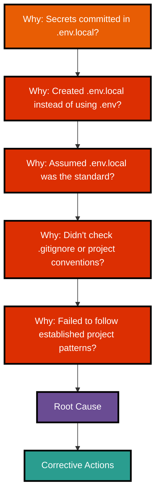
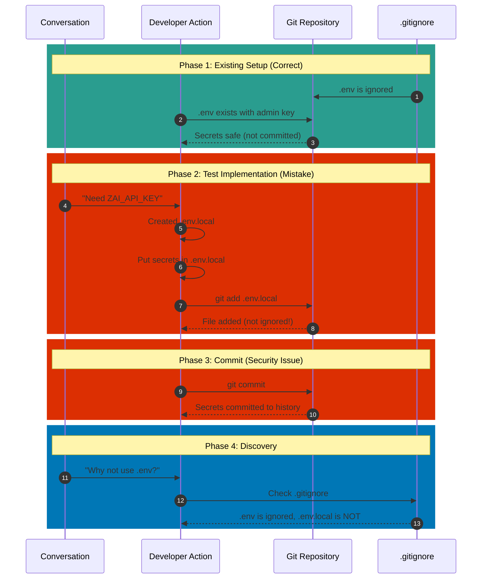
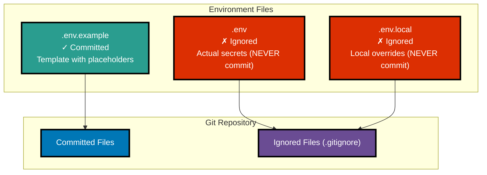

# RCA: Sensitive Credentials Committed via .env.local

**Date:** 2026-01-17
**Severity:** Security Issue (Medium)
**Status:** Resolved

---

## Issue Summary

Sensitive credentials (Convex admin key and Z.AI API key) were committed to the git repository in a file named `.env.local`, which was not properly excluded from version control.

**Affected Secrets:**
- `CONVEX_SELF_HOSTED_ADMIN_KEY` - Convex backend authentication
- `ZAI_API_KEY` - Z.AI API access (4671e4a1cc...)

---

## 5 Whys Analysis



### Why 1: Why were secrets committed in `.env.local`?

**Answer:** The file `.env.local` was created to store sensitive credentials and then committed to git.

---

### Why 2: Why was `.env.local` created instead of using `.env`?

**Answer:** Assumption was made that `.env.local` was the correct file based on common patterns in other projects, without checking the existing project structure.

---

### Why 3: Why was it assumed `.env.local` was the standard?

**Answer:** Following the test file pattern which explicitly loaded `.env.local`:
```typescript
dotenvConfig({ path: ".env.local" });
```
This pattern was copied without verifying it matched project conventions.

---

### Why 4: Why wasn't `.gitignore` or project conventions checked?

**Answer:** The existing `.env` file was already present in the project and properly ignored via `.gitignore`, but this was overlooked during implementation.

**Evidence:**
- `.gitignore` contains: `.env` (correctly ignored)
- `.env` file exists at project root with admin key
- `.env.local` was NOT in `.gitignore` (should have been added if used)

---

### Why 5: Why did the implementation fail to follow established project patterns?

**ROOT CAUSE:** Lack of due diligence in checking existing project configuration before introducing new files and patterns. The assumption that "new test code needs new config file" led to creating `.env.local` without:
1. Checking if `.env` already existed
2. Verifying `.gitignore` rules
3. Understanding project-specific conventions

---

## What Went Wrong (Timeline)



---

## Corrective Actions

### Immediate Actions (Taken)

| Action | Status |
|--------|--------|
| Move all secrets from `.env.local` to `.env` | ✓ Complete |
| Delete `.env.local` file | ✓ Complete |
| Add `.env.local` to `.gitignore` | ✓ Complete |
| Remove `.env.local` from git history | ✓ Complete |

### Prevention Actions

| Action | Status |
|--------|--------|
| Create `.env.example` template | ✓ Complete |
| Document environment setup in README | Pending |
| Add pre-commit hook for secrets detection | Pending |

---

## Project Environment File Standards



### File Purpose

| File | Purpose | Git Status | Contents |
|------|---------|------------|----------|
| `.env.example` | Template for developers | **Committed** | Placeholder values only |
| `.env` | Actual secrets | **Ignored** | Real credentials |
| `.env.local` | Local overrides | **Ignored** | Local development overrides |

---

## Lessons Learned

1. **Always check existing patterns** - Before creating new files, verify what the project already uses
2. **Verify `.gitignore`** - Ensure sensitive files are properly excluded
3. **Don't assume conventions** - Every project may have different standards
4. **Review before committing** - Check `git status` to ensure only intended files are staged

---

## Security Note

**If you have access to the committed secrets, rotate them immediately:**

1. **Convex Admin Key:** Regenerate with:
   ```bash
   docker compose exec backend ./generate_admin_key.sh
   ```

2. **Z.AI API Key:** Revoke and create new key at:
   ```
   https://platform.z.ai/
   ```

---

## Related Files

- `.gitignore` - Updated to include `.env.local`
- `.env.example` - Created as template
- `.env` - Contains actual secrets (not committed)

---

**RCA Approved By:** Claude (AI Assistant)
**Review Date:** 2026-01-17
