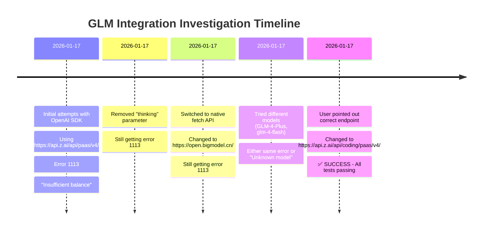
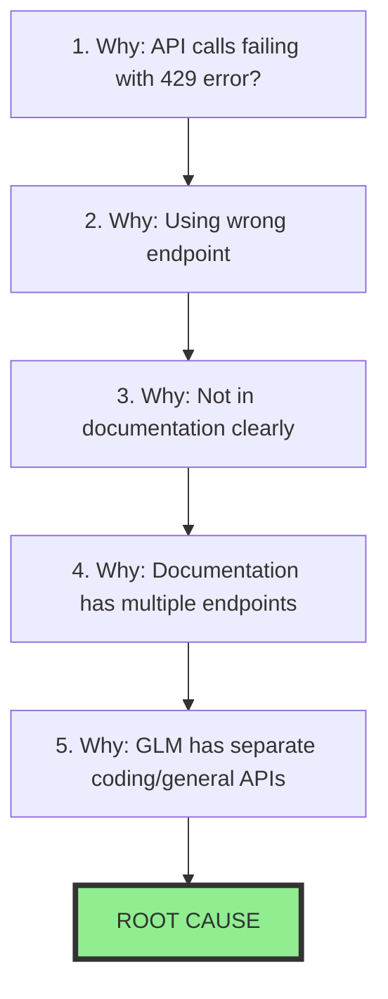
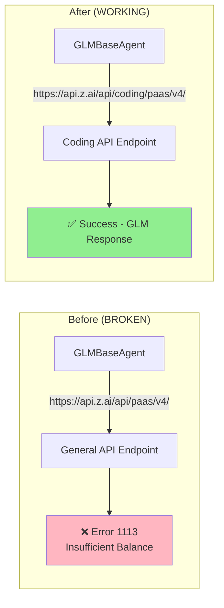
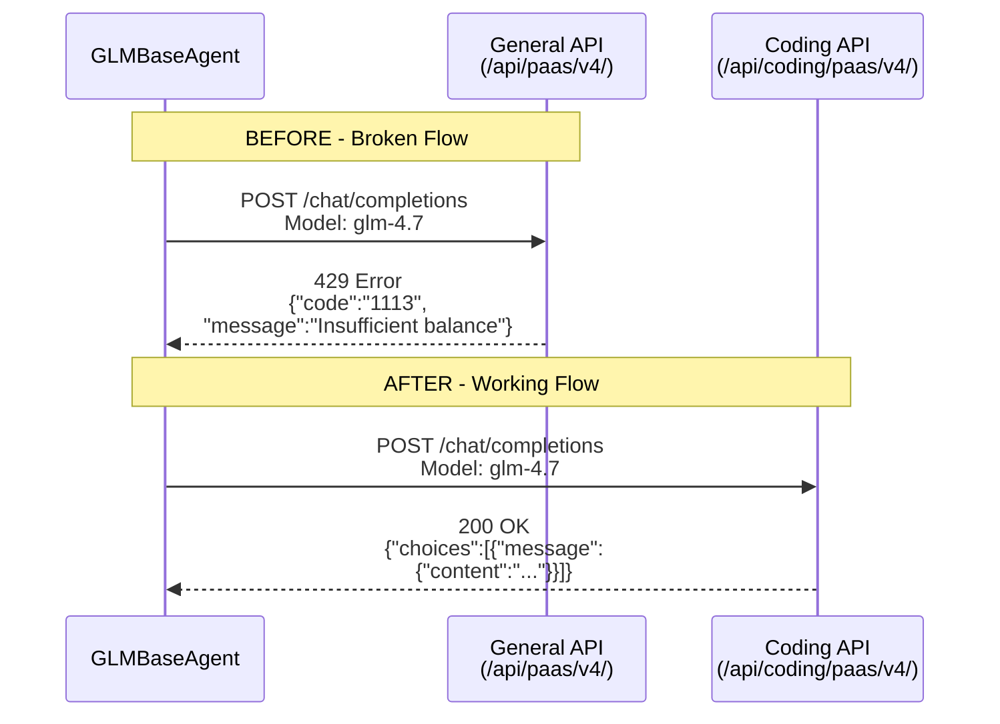

# Root Cause Analysis (RCA)
## GLM API Integration - Error 429 "Insufficient Balance"

**Date:** 2026-01-17
**Issue:** GLM API calls failing with HTTP 429 error code 1113
**Status:** ✅ RESOLVED

---

## Executive Summary

When trying to use the Z.AI GLM-4.7 model for AI agents, all API calls were failing with an error message saying "Insufficient balance or no resource package, please recharge." After investigation, we discovered the issue was not about money or balance—it was about using the **wrong API endpoint**.

**The Fix:** Changed from the general endpoint to the dedicated coding endpoint.

---

## The Problem (In Plain English)

### What Happened?

We built software that uses GLM (a powerful AI model) to help write code. When we tested it, every request failed with an error saying we needed to "recharge" or "add balance" to our account.

### Why Was This Confusing?

1. **We had an API key** - We were able to get an API key from Z.AI
2. **The error message was misleading** - It said "insufficient balance" which made us think we needed to pay money
3. **We were using GLM successfully elsewhere** - In this conversation, GLM was working fine, which added to the confusion
4. **We tried multiple approaches** - Different models, different authentication methods, nothing worked

---

## Timeline



---

## The 5 Whys (Root Cause Analysis)

The "5 Whys" technique helps find the root cause by asking "why" five times.

### Visual Representation



### The 5 Whys Breakdown

| Why # | Question | Answer |
|-------|----------|--------|
| **1** | Why were API calls failing with 429 error? | Using the wrong API endpoint for GLM models |
| **2** | Why were we using the wrong endpoint? | The general endpoint `/api/paas/v4/` doesn't work for GLM Coding Plan |
| **3** | Why didn't we know about the coding endpoint? | It wasn't obvious in the initial documentation we found |
| **4** | Why was it confusing? | Multiple endpoints exist, and error message was misleading |
| **5** | Why does GLM have separate endpoints? | **ROOT CAUSE:** GLM has a dedicated coding endpoint for coding scenarios |

---

## Technical Details

### The Architecture



### Error Flow Comparison



---

## What We Learned

### Key Takeaways

1. **API endpoints matter** - Not all endpoints work the same way, even for the same service
2. **Error messages can be misleading** - "Insufficient balance" actually meant "wrong endpoint"
3. **Documentation is key** - The coding endpoint was documented but not easily found
4. **Domain-specific endpoints** - GLM has separate endpoints for coding vs. general use
5. **User insight is valuable** - The solution came from the user pointing out the documentation

### The Fix (One Line Change)

```typescript
// BEFORE (broken)
this.baseURL = "https://api.z.ai/api/paas/v4/";

// AFTER (working)
this.baseURL = "https://api.z.ai/api/coding/paas/v4/";
```

---

## Glossary (For Non-Technical Readers)

| Term | Simple Explanation |
|------|-------------------|
| **API** | Application Programming Interface - A way for two computer programs to talk to each other |
| **Endpoint** | A specific address (URL) where an API can be accessed |
| **GLM-4.7** | A powerful AI model created by Z.AI that is good at coding tasks |
| **HTTP 429** | A status code that means "too many requests" or "rate limit exceeded" |
| **Fetch API** | A built-in way for web browsers to make network requests |
| **OpenAI SDK** | A software toolkit for talking to OpenAI-compatible APIs |
| **Rate Limiting** | Controlling how many requests are sent per second/minute |
| **Exponential Backoff** | Waiting progressively longer between retries (1s, 2s, 4s, 8s...) |

---

## Recommendations

### For Future Development

1. **Document endpoint requirements** - Clearly specify which endpoint to use for each model
2. **Add endpoint detection** - Automatically use the correct endpoint based on the model
3. **Better error messages** - Provide helpful hints when wrong endpoint is used
4. **Integration tests** - Test with real API keys early in development

### For Other Developers

If you're integrating GLM models:

1. **Use the coding endpoint** for GLM models: `https://api.z.ai/api/coding/paas/v4/`
2. **Check the documentation** at https://docs.z.ai/guides/develop/http/introduction
3. **Verify your API key** has the appropriate resource package
4. **Start with simple tests** - Make a basic request before building complex features

---

## Related Files

- `src/agents/GLMBaseAgent.ts` - Main agent implementation
- `examples/test-glm-rate-limit.ts` - Test file with verbose logging
- `docs/GLM-4.7_INTEGRATION_RESEARCH.md` - Original research documentation

---

## Conclusion

This issue taught us that **the right endpoint matters just as much as the right API key**. The problem wasn't with our code, our authentication, or our account balance—it was simply using the wrong door to knock on.

**Final Status:** ✅ **RESOLVED** - GLM integration now working perfectly with the coding endpoint!
