# RCA: Workflow Example Stalled - Why `npx tsx examples/real-example.ts` Hung Indefinitely

**Date:** 2025-01-17
**Issue:** Multi-agent workflow example stalls and never exits
**Status:** ✅ Fixed
**Severity:** High (blocks users from completing workflows)

---

## Executive Summary

The `npx tsx examples/real-example.ts` command completed all workflow steps successfully but **never exited** and hung indefinitely. Users had to manually kill the process with `Ctrl+C`.

**Root Cause:** The Convex client maintains a persistent WebSocket connection for real-time updates. This connection was never closed, keeping the Node.js process alive even after all work was done.

**Fix:** Added proper cleanup of the Convex client connection at the end of the workflow.

---

## The Problem: What Users Experienced

```bash
$ npx tsx examples/real-example.ts

[Workflow runs...]

✓ Workflow completed successfully!
  You can now inspect the artifacts in the workspace directory.

[More output...]

[Process hangs here indefinitely - never returns to command prompt]
```

The cursor just sat there blinking. The user had to press `Ctrl+C` to get back to their terminal.

---

## Root Cause Analysis

### What Was Happening?


### The Technical Details

**In Simple Terms:**

1. The Convex client is like a phone line that stays open
2. Node.js won't exit while any "phone lines" are still connected
3. We never told the client to "hang up" the phone
4. So Node.js waited forever for something that would never happen

**In Technical Terms:**

The `ConvexClient` class establishes a WebSocket connection to the Convex backend for real-time data synchronization. In Node.js, the event loop keeps running as long as there are active handles (like network sockets). Since the WebSocket was never explicitly closed, the process never exited.

---

## The Fix

### Code Changes

**File 1: `src/convex/client.ts`**

Added a cleanup function:

```typescript
/**
 * Closes the Convex client connection.
 * Call this when shutting down the application to prevent hanging processes.
 */
export async function closeConvexClient(): Promise<void> {
  await client.close();
}
```

**File 2: `src/orchestrator/SequentialOrchestrator.ts`**

Added cleanup at the end of workflow:

```typescript
// Close Convex client connection to prevent hanging
try {
  await closeConvexClient();
  console.log("[Orchestrator] Closed Convex client connection");
} catch (error) {
  console.error(`[Orchestrator] Failed to close Convex client: ${error}`);
}
```

### Flow After Fix

```mermaid
sequenceDiagram
    autonumber
    participant User
    participant Script as real-example.ts
    participant Orchestrator as SequentialOrchestrator
    participant Convex as Convex Client
    participant WebSocket as Convex Backend

    rect rgb(43, 45, 66)
        User->>Script: npx tsx examples/real-example.ts
        Script->>Orchestrator: executeWorkflow()
        Orchestrator->>Convex: Import client module
    end

    rect rgb(232, 93, 4)
        Note over Convex,WebSocket: 🔌 WebSocket opened
        Convex->>WebSocket: Connect
        WebSocket-->>Convex: Connected
    end

    rect rgb(42, 157, 143)
        Orchestrator->>Orchestrator: Run all workflow steps
        Note over Orchestrator: All steps complete!
        Orchestrator->>Convex: closeConvexClient()
    end

    rect rgb(42, 157, 143)
        Note over Convex,WebSocket: ✅ WebSocket closed properly
        Convex->>WebSocket: Close connection
        WebSocket-->>Convex: Connection closed
        Orchestrator-->>Script: Return result
        Script-->>User: Print success message
        Note over User: ✅ Process exits cleanly
        Note over User: Back to command prompt
    end
```



---

## Is This Manual Closing? Yes, But...

### Yes, It's Manual

We explicitly call `client.close()` in our code. This is **manual cleanup** - we have to remember to do it.

### But Why Manual?

**Automatic cleanup in Node.js is tricky:**

1. **No built-in destructors** - Unlike some languages, Node.js doesn't guarantee cleanup code runs on exit

2. **Multiple exit paths** - A program can exit normally, error out, be killed, crash, etc. Handling all cases is complex

3. **Resource timing** - You need to close connections AFTER all work is done, but BEFORE the process tries to exit

4. **Singleton pattern** - The Convex client is a shared resource (singleton), so it's not clear who "owns" it and should clean it up

### Better Approaches (Not Implemented Here)

```typescript
// Option 1: Using process.on('exit') - Doesn't work well!
// Why: The 'exit' event fires AFTER the event loop stops,
// so async operations like close() won't complete
process.on('exit', () => {
  // Too late for async cleanup!
});

// Option 2: Using process.on('beforeExit') - Better
process.on('beforeExit', async () => {
  await closeConvexClient();
});

// Option 3: Explicit cleanup pattern (what we did)
// Most reliable because it's explicit and predictable
```

---

## 5 Reasons Why We Didn't Notice Earlier

### 1. **No Visible Symptoms During Development**


During development, developers naturally pressed `Ctrl+C` to stop the process after seeing the success message. This became a habit, so nobody questioned why the process didn't exit on its own.

---

### 2. **Focus Was on Features, Not Cleanup**

**The Priority Hierarchy:**

```
1. ✅ Make the workflow work
2. ✅ Handle GLM API integration
3. ✅ Parse JSON responses correctly
4. ✅ Save artifacts to disk
5. ✅ Fix JSON parsing bugs
...
99. ❌ Properly close connections
```

When building a new feature, you focus on making it **work** first. Cleanup and optimization come later. We were still in "make it work" mode.

---

### 3. **Async/Await Masked the Problem**

```typescript
// This code LOOKS complete:
async function main() {
  const result = await orchestrator.executeWorkflow(context);
  console.log("✓ Success!");
  // Function ends here - looks like it should exit
}

// But the Convex client was imported at module level,
// OUTSIDE this function, so it's still alive!
```

The async function completed, but the **module-level singleton** (the Convex client) was still active. This separation made the problem invisible.

---

### 4. **No Automated Tests for Process Exit**

```typescript
// We tested this:
✓ Does the workflow complete?
✓ Are the artifacts created?
✓ Is the JSON valid?

// We didn't test this:
❌ Does the process exit cleanly?
```

Our tests checked if the workflow **worked**, not if it **cleaned up after itself**. A simple test would have caught this:

```typescript
// What we SHOULD have tested:
test("process exits cleanly", async () => {
  const exitCode = await runWorkflowAndGetExitCode();
  expect(exitCode).toBe(0);
});
```

---

### 5. **Common Pattern in Other Frameworks**

In many frameworks, connection cleanup **is automatic**:

| Framework | Connection Cleanup |
|-----------|-------------------|
| Express.js | Automatic (server.listen() can be closed, but often runs forever) |
| Next.js | Automatic (serverless functions) |
| Scripts | Often exit when done (no persistent connections) |
| **Convex Client** | **Manual** (maintains persistent WebSocket) |

**The Assumption:** Developers assumed the Convex client would behave like other clients and clean up automatically.

---

## Timeline of Discovery


---

## Lessons Learned

### For Developers

1. **Always clean up resources** - If you open a connection, close it
2. **Test process exit** - Add tests that verify clean shutdown
3. **Question habits** - If you always press Ctrl+C, ask why
4. **Watch for singletons** - Module-level singletons need explicit cleanup
5. **Document cleanup** - Make it obvious when resources need cleanup

### For Code Reviewers

1. **Check for resource leaks** - Look for opened connections without close()
2. **Ask about shutdown** - "How does this process exit?"
3. **Review imports** - What resources are created at import time?
4. **Test manually** - Actually run the example and wait for exit

---

## Prevention Checklist

Use this checklist when reviewing code that uses external clients:

- [ ] Does this code open any connections (WebSocket, database, HTTP)?
- [ ] Are those connections closed after use?
- [ ] Is there a cleanup/shutdown function?
- [ ] Does the process exit cleanly when done?
- [ ] Are there tests for cleanup?
- [ ] Is the cleanup documented?

---

## Related Files

- **Fix:** `src/convex/client.ts` - Added `closeConvexClient()` function
- **Fix:** `src/orchestrator/SequentialOrchestrator.ts` - Calls cleanup before return
- **Context:** `examples/real-example.ts` - The example that was hanging
- **Related:** `docs/RCA_GLM_INTEGRATION.md` - Previous GLM integration issues

---

## Glossary

| Term | Meaning |
|------|---------|
| **WebSocket** | A persistent connection that stays open for two-way communication |
| **Node.js Event Loop** | The mechanism that keeps Node.js running while there's work to do |
| **Singleton** | A pattern where only one instance of something exists (shared across the app) |
| **Handle** | An active resource like a network socket or file that keeps Node.js alive |
| **Cleanup** | Releasing resources (closing connections, freeing memory) when done |
| **SIGKILL (Exit 137)** | Force kill signal - 128 + 9 = 137 |

---

## Summary

| Question | Answer |
|----------|--------|
| **What happened?** | Workflow completed but process hung indefinitely |
| **Why?** | Convex WebSocket connection was never closed |
| **Is it manual?** | Yes, we explicitly call `close()` - no automatic cleanup |
| **Why didn't we notice?** | Ctrl+C became habitual, focus was on features, no exit tests |
| **Is it fixed?** | ✅ Yes - `closeConvexClient()` is now called at workflow end |
