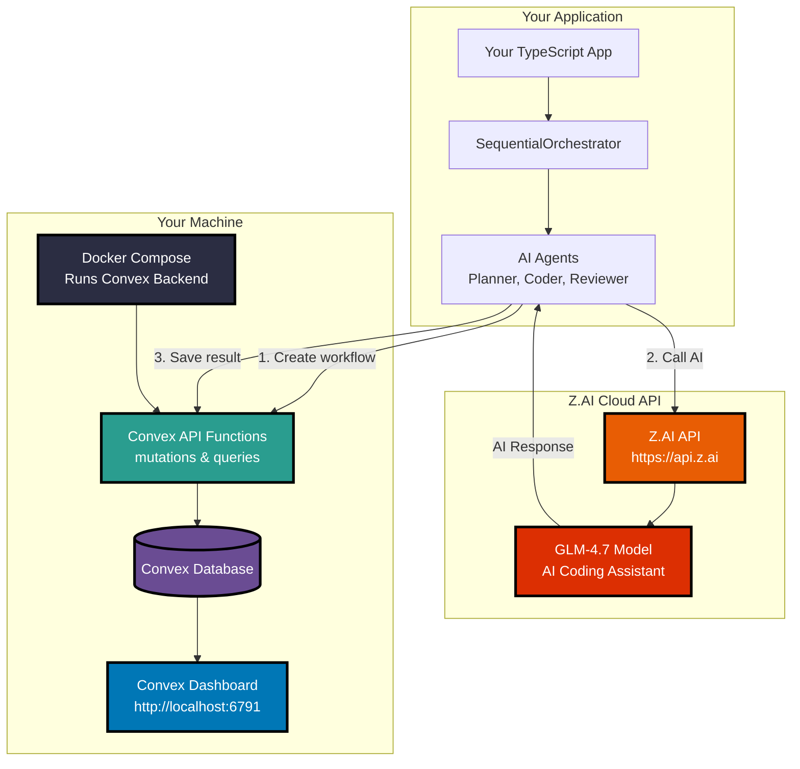
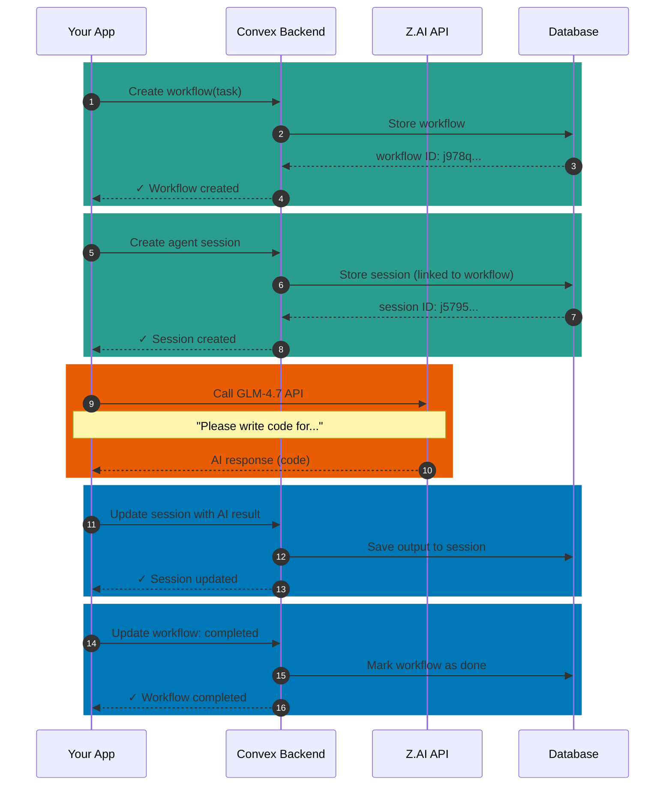
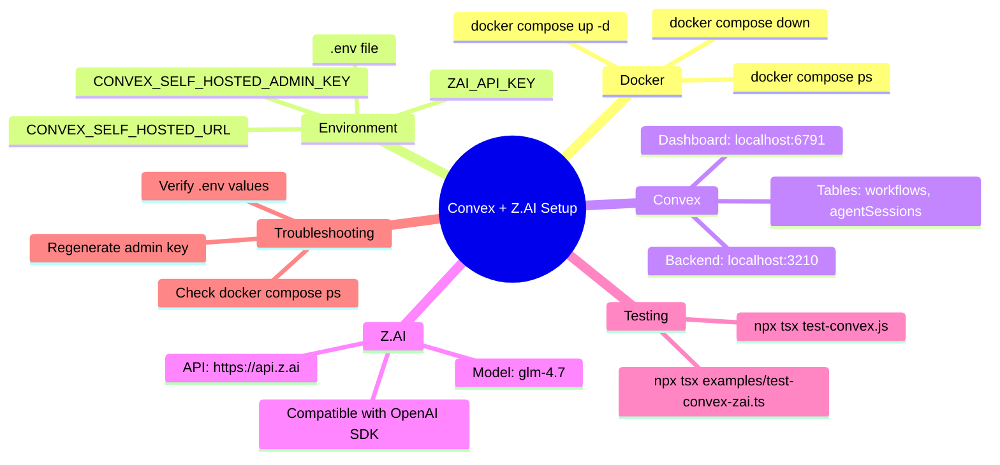

# Complete Setup Guide: Convex + Z.AI (GLM-4.7) Integration

**A beginner-friendly guide to setting up self-hosted Convex backend and integrating with Z.AI's GLM-4.7 model**

---

## Table of Contents

1. [Overview](#overview)
2. [Architecture Diagram](#architecture-diagram)
3. [Part 1: Setting Up Self-Hosted Convex](#part-1-setting-up-self-hosted-convex)
4. [Part 2: Setting Up Z.AI Integration](#part-2-setting-up-zai-integration)
5. [Part 3: Testing Your Setup](#part-3-testing-your-setup)
6. [Troubleshooting](#troubleshooting)

---

## Overview

This guide will help you:

- ✅ Deploy a **Convex backend** on your own machine (self-hosted)
- ✅ Create database tables and API functions
- ✅ Integrate with **Z.AI's GLM-4.7** model (a powerful AI for coding)
- ✅ Track AI agent sessions and workflows in Convex
- ✅ Test everything end-to-end

### What is Convex?

**Convex** is a backend-as-a-service platform that provides:
- Real-time database (your data updates instantly)
- API functions (like server-side code)
- Dashboard to view your data

**Self-hosted** means it runs on YOUR machine, not in the cloud. You have full control.

### What is Z.AI GLM-4.7?

**GLM-4.7** is an AI model (like ChatGPT) from Z.AI that's excellent at:
- Writing code
- Following instructions
- Multi-step reasoning

It's **compatible with OpenAI's format**, making integration easy!

---

## Architecture Diagram

Here's how everything connects:



### How Data Flows



---

## Part 1: Setting Up Self-Hosted Convex

### Prerequisites

Before starting, ensure you have:

- **Docker** installed ([Download here](https://www.docker.com/products/docker-desktop/))
- **Node.js** version 20 or higher
- A terminal application (Terminal on macOS, Command Prompt on Windows)

### Step 1: Create Project Directory

Open your terminal and create a new folder for your project:

```bash
mkdir my-ai-project
cd my-ai-project
```

### Step 2: Create Docker Compose File

Create a file named `docker-compose.yml` with this content:

```yaml
services:
  convex-backend:
    image: ghcr.io/get-convex/convex-backend:latest
    ports:
      - "3210:3210"  # API port
      - "3211:3211"  # HTTP actions port
    environment:
      - CONVEX_CLOUD_ORIGIN=http://localhost:3210
      - CONVEX_SITE_ORIGIN=http://localhost:3211
      - CONVEX_SELF_HOSTED_ADMIN_KEY=${CONVEX_SELF_HOSTED_ADMIN_KEY}
    volumes:
      - convex_data:/convex/data
    restart: unless-stopped

  convex-dashboard:
    image: ghcr.io/get-convex/convex-dashboard:latest
    ports:
      - "6791:6791"   # Dashboard port
    environment:
      - NEXT_PUBLIC_DEPLOYMENT_URL=http://localhost:3210
    depends_on:
      - convex-backend
    restart: unless-stopped

volumes:
  convex_data:
```

**What this does:**
- Downloads Convex backend and dashboard
- Runs them on ports 3210 (backend) and 6791 (dashboard)
- Stores data persistently (survives restarts)

### Step 3: Start Convex Backend

```bash
# Start the services
docker compose up -d

# Wait for services to be healthy (about 30 seconds)
docker compose ps
```

You should see something like:

```
NAME                            STATUS    PORTS
convex-poc-convex-backend-1     Up       0.0.0.0:3210-3211
convex-poc-convex-dashboard-1   Up       0.0.0.0:6791
```

### Step 4: Generate Admin Key

The admin key is like a password that lets your code access Convex:

```bash
docker compose exec backend ./generate_admin_key.sh
```

You'll see output like:

```
convex-self-hosted|018795c33a293daadc0bab0e761e58d575544303062946537f9142669688312e9ebaf59dbd
```

**Copy this entire string!** You'll need it in the next step.

### Step 5: Save Configuration

Create a `.env` file to store your configuration:

```bash
# .env
CONVEX_SELF_HOSTED_URL=http://127.0.0.1:3210
CONVEX_SELF_HOSTED_ADMIN_KEY=paste-your-key-here
```

Replace `paste-your-key-here` with the full key from Step 4.

### Step 6: Verify Dashboard is Working

Open your browser and visit: **http://localhost:6791**

You should see the Convex Dashboard login screen. This confirms your backend is running!

---

## Part 2: Setting Up Z.AI Integration

### Prerequisites

- A Z.AI account ([Sign up at https://platform.z.ai/](https://platform.z.ai/))
- API credit (paid plans start at $3/month)

### Step 1: Get Your Z.AI API Key

1. Go to https://platform.z.ai/
2. Sign in or create an account
3. Navigate to **API Keys** section
4. Click **Create New Key**
5. Copy your API key (looks like: `4671e4a1cc...`)

### Step 2: Save API Key to Environment

Add this line to your `.env` file:

```bash
ZAI_API_KEY=your-api-key-here
```

Your complete `.env` should look like:

```bash
CONVEX_SELF_HOSTED_URL=http://127.0.0.1:3210
CONVEX_SELF_HOSTED_ADMIN_KEY=convex-self-hosted|your-full-key-here
ZAI_API_KEY=4671e4a1cc714fe19ab2675d0a1279e4.6LBtjGBGTSN4hekM

# Agent Provider Selection (optional)
# Options: "claude" (default) or "glm"
BASE_AGENT=claude
```

### Understanding BASE_AGENT Configuration

The `BASE_AGENT` environment variable controls which AI provider your agents use:

| Value | Provider | Model | Use When |
|-------|----------|-------|----------|
| `claude` (or unset) | Anthropic | sonnet/opus/haiku | You want Claude SDK features |
| `glm` | Z.AI | GLM-4.7 | You want GLM-4.7 with thinking mode |

**How it works:**
- All agents (Planner, Coder, Reviewer) respect this setting
- The `AgentFactory` reads `BASE_AGENT` and creates appropriate agent instances
- Individual agents can override via `provider` property in their config

**Example:**
```typescript
// Uses BASE_AGENT env var (defaults to "claude")
const planner = AgentFactory.createPlanner({ agentType: "planner" });

// Override to use GLM regardless of env var
const coder = AgentFactory.createCoder({
  agentType: "coder",
  provider: "glm"
});
```

### Step 3: Install Dependencies

```bash
# Initialize your Node.js project
npm init -y

# Install required packages
npm install convex openai dotenv
npm install -D tsx typescript
```

**What each package does:**

| Package | Purpose |
|---------|---------|
| `convex` | Convex client library |
| `openai` | API client (works with Z.AI) |
| `dotenv` | Loads environment variables |
| `tsx` | Runs TypeScript directly |
| `typescript` | Type checking |

---

## Part 3: Testing Your Setup

### Quick Test: Verify Convex Connection

Create a file `test-convex.js`:

```javascript
import "dotenv/config.js";

// Simple test - can we reach Convex?
const CONVEX_URL = process.env.CONVEX_SELF_HOSTED_URL;
const ADMIN_KEY = process.env.CONVEX_SELF_HOSTED_ADMIN_KEY;

console.log("Testing Convex connection...");
console.log(`URL: ${CONVEX_URL}`);
console.log(`Admin Key: ${ADMIN_KEY.substring(0, 20)}...`);

fetch(`${CONVEX_URL}/api/ping`)
  .then(r => r.json())
  .then(data => console.log("✓ Convex is alive!", data))
  .catch(e => console.error("✗ Error:", e.message));
```

Run it:

```bash
npx tsx test-convex.js
```

Expected output:

```
✓ Convex is alive!
```

### Full Test: Convex + Z.AI Integration

The test file we created earlier demonstrates the complete flow. Here's what it does:

```mermaid
flowchart LR
    A[Start Test] --> B[Load Environment<br/>.env]
    B --> C[Check API Keys<br/>ZAI_API_KEY<br/>CONVEX_ADMIN_KEY]
    C --> D[Create Workflow<br/>in Convex]
    D --> E[Create Agent Session<br/>linked to workflow]
    E --> F[Call GLM-4.7 API<br/>ask for code]
    F --> G[Save AI Response<br/>to session]
    G --> H[Mark Workflow<br/>completed]
    H --> I[Verify in Dashboard<br/>http://localhost:6791]

    style A fill:#2B2D42,stroke:#000,stroke-width:3px,color:#fff
    style B fill:#0077B6,stroke:#000,stroke-width:3px,color:#fff
    style C fill:#0077B6,stroke:#000,stroke-width:3px,color:#fff
    style D fill:#2A9D8F,stroke:#000,stroke-width:3px,color:#fff
    style E fill:#2A9D8F,stroke:#000,stroke-width:3px,color:#fff
    style F fill:#E85D04,stroke:#000,stroke-width:3px,color:#fff
    style G fill:#6A4C93,stroke:#000,stroke-width:3px,color:#fff
    style H fill:#6A4C93,stroke:#000,stroke-width:3px,color:#fff
    style I fill:#2A9D8F,stroke:#000,stroke-width:3px,color:#fff
```



### Running the Test

```bash
npx tsx examples/test-convex-zai.ts
```

**Expected output:**

```
╔═══════════════════════════════════════════════════════════╗
║  Convex + GLM-4.7 Integration Test                        ║
╚═══════════════════════════════════════════════════════════╝

=== Convex + GLM-4.7 Integration Test ===

Configuration:
  ZAI_API_KEY: 4671e4a1cc...
  Convex URL: http://127.0.0.1:3210
  Convex Admin Key: convex-self-hosted|0...

[1/5] Creating workflow in Convex...
  ✓ Workflow created: j978qwbxwkfey2hsqazzk1dans7zar3t

[2/5] Creating agent session...
  ✓ Session created: j5795tg6n16may6x2b32g7jsdx7za6py

[3/5] Calling GLM-4.7 via z.ai...
  ✓ GLM-4.7 response received

[4/5] Updating agent session...
  ✓ Session updated

[5/5] Updating workflow status...
  ✓ Workflow updated

✓ Test Complete!
```

### Viewing Data in Dashboard

1. Go to http://localhost:6791
2. Log in with your admin key
3. Click **"Data"** in the sidebar
4. Look for tables:
   - `workflows` - Contains your workflow records
   - `agentSessions` - Contains AI agent session records

---

## Troubleshooting

### Problem: "Command not found: docker"

**Solution:** Install Docker Desktop from https://www.docker.com/products/docker-desktop/

### Problem: Convex dashboard shows "Connection refused"

**Solution:**

1. Check if backend is running:
   ```bash
   docker compose ps
   ```

2. If it shows "Exited", restart:
   ```bash
   docker compose down
   docker compose up -d
   ```

### Problem: 401 Unauthorized when deploying

**Solution:** Your admin key is missing or invalid. Regenerate it:

```bash
docker compose exec backend ./generate_admin_key.sh
```

Update `.env` with the new key.

### Problem: Z.AI API returns 429 Insufficient Balance

**Solution:** Your Z.AI account needs more credit. Visit https://platform.z.ai/ to recharge.

### Problem: "Cannot find module 'convex'"

**Solution:** Install dependencies:

```bash
npm install convex
```

### Problem: Port 3210 or 6791 already in use

**Solution:** Something else is using those ports. To find what:

```bash
# On macOS/Linux
lsof -i :3210
lsof -i :6791
```

Stop the conflicting service, or change the ports in `docker-compose.yml`.

---

## Summary Diagram

Here's the complete picture of what you've built:

```mermaid
flowchart TB
    subgraph "Developer Experience"
        DEV[You: Developer]
        ENV[.env<br/>Store secrets]
        CLI[Terminal<br/>Run commands]
    end

    subgraph "Application Layer"
        APP[Your TypeScript Code]
        CLIENT[Convex Client<br/>Z.AI Client]
    end

    subgraph "Backend Services"
        CONVEX[(Self-Hosted Convex)]
        ZAI_CLOUD[(Z.AI Cloud API)]
    end

    subgraph "Data Layer"
        DB[(Database Tables)<br/>• workflows<br/>• agentSessions]
        DASH[Dashboard<br/>Visualize Data]
    end

    DEV -->|1. Configure| ENV
    DEV -->|2. Start| CLI

    CLI -->|Start Docker| CONVEX
    CLI -->|Run tests| APP

    APP -->|Store state| CLIENT
    CLIENT -->|Write| CONVEX
    CLIENT -->|Query| ZAI_CLOUD

    CONVEX -->|Persist| DB
    CONVEX -->|Serve| DASH

    style DEV fill:#2B2D42,stroke:#000,stroke-width:3px,color:#fff
    style ENV fill:#0077B6,stroke:#000,stroke-width:3px,color:#fff
    style CLI fill:#0077B6,stroke:#000,stroke-width:3px,color:#fff
    style APP fill:#2A9D8F,stroke:#000,stroke-width:3px,color:#fff
    style CLIENT fill:#2A9D8F,stroke:#000,stroke-width:3px,color:#fff
    style CONVEX fill:#E85D04,stroke:#000,stroke-width:3px,color:#fff
    style ZAI_CLOUD fill:#DC2F02,stroke:#000,stroke-width:3px,color:#fff
    style DB fill:#6A4C93,stroke:#000,stroke-width:3px,color:#fff
    style DASH fill:#0077B6,stroke:#000,stroke-width:3px,color:#fff
```

---

## Next Steps

Now that you have Convex and Z.AI set up:

1. **Explore the Dashboard** - Go to http://localhost:6791 and look around
2. **Create Your Own API Functions** - Define custom mutations/queries in `convex/`
3. **Build an AI Agent** - Use the pattern from the test to create your own agents
4. **Scale Up** - Add more agents, workflows, and features

### Helpful Commands

```bash
# Start/Stop Convex
docker compose up -d      # Start
docker compose down        # Stop
docker compose ps          # Check status

# View logs
docker compose logs -f     # Follow logs
docker compose logs backend # Backend logs only

# Restart (if something goes wrong)
docker compose restart
```

---

## Quick Reference Card



---

**Congratulations! 🎉** You now have a fully functional Convex backend with Z.AI integration!

For more details, see:
- [Convex Documentation](https://docs.convex.dev/)
- [Z.AI Documentation](https://docs.z.ai/)
- [OpenAI SDK Reference](https://github.com/openai/openai-node)
