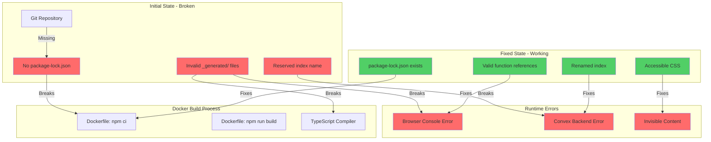

# Root Cause Analysis (RCA)
## Self-Hosted Convex Deployment Issues

**Date:** January 15, 2024
**Project:** Convex POC - Self-Hosted Real-Time Database
**Severity:** High - Application completely non-functional

---

## Executive Summary

When attempting to deploy a self-hosted Convex application using `python deploy.py up`, the Docker build failed with multiple cascading issues. The root causes were: (1) missing package-lock.json file, (2) incorrectly generated TypeScript files incompatible with Convex v1.17.3, (3) misnamed reserved index in database schema, (4) incorrect function reference structure for Convex SDK, and (5) poor accessibility with white text on white background.

---

## Issues Discovered

| Issue | Impact | Severity |
|-------|--------|----------|
| Missing `package-lock.json` | `npm ci` command failed in Docker build | High |
| Corrupted generated TypeScript files | Build errors, type mismatches | High |
| Reserved index name `by_creation_time` | Schema deployment rejected | High |
| Wrong function reference format | Runtime JavaScript errors | Critical |
| White text on white background | Content invisible, accessibility failure | High |

---

## Problem Timeline

```
┌─────────────────────────────────────────────────────────────────────────┐
│                        DEPLOYMENT FAILURE CHAIN                         │
├─────────────────────────────────────────────────────────────────────────┤
│                                                                         │
│  1. RUN: python deploy.py up                                            │
│     │                                                                   │
│     ▼                                                                   │
│  2. ERROR: npm ci fails - missing package-lock.json                     │
│     │                                                                   │
│     ├─ FIX: Run npm install to generate lock file                       │
│     │                                                                   │
│     ▼                                                                   │
│  3. ERROR: TypeScript compilation fails                                 │
│     │    - Syntax errors in dataModel.ts                                │
│     │    - Missing exports in server.ts                                 │
│     │    - Wrong client class in main.tsx                               │
│     │                                                                   │
│     ├─ FIX: Manually create stub files                                  │
│     │                                                                   │
│     ▼                                                                   │
│  4. ERROR: Function reference validation fails                          │
│     │    "[object Object] is not a functionReference"                   │
│     │                                                                   │
│     ├─ FIX: Add Symbol.for("functionName") to function refs             │
│     │                                                                   │
│     ▼                                                                   │
│  5. ERROR: Schema deployment rejected                                   │
│     │    "IndexNameReserved: by_creation_time"                          │
│     │                                                                   │
│     ├─ FIX: Rename to by_created_at                                     │
│     │                                                                   │
│     ▼                                                                   │
│  6. ERROR: Functions not deployed to backend                            │
│     │    "Could not find public function"                               │
│     │                                                                   │
│     ├─ FIX: Move files to convex/ folder, deploy                        │
│     │                                                                   │
│     ▼                                                                   │
│  7. ERROR: White text on white background                               │
│     │    Content invisible to users                                     │
│     │                                                                   │
│     ├─ FIX: Update CSS for proper contrast                              │
│     │                                                                   │
│     ▼                                                                   │
│  8. SUCCESS: Application fully functional                               │
│                                                                         │
└─────────────────────────────────────────────────────────────────────────┘
```

---

## Root Cause Analysis - The 5 Whys

### Issue #1: Missing package-lock.json

**Problem:** Docker build failed with `npm ci` error

| Why Level | Question | Answer |
|-----------|----------|--------|
| 1st Why | Why did the Docker build fail? | The `npm ci` command failed because `package-lock.json` was missing |
| 2nd Why | Why was package-lock.json missing? | The project was committed without running `npm install` first, which generates the lock file |
| 3rd Why | Why wasn't npm install run before commit? | The lock file was excluded or the initial setup step was missed |
| 4th Why | Why didn't the build process catch this? | Dockerfile assumes `npm ci` will work without checking for the lock file first |
| 5th Why | Why use npm ci instead of npm install? | `npm ci` is faster and more reliable for production builds, but requires a lock file |

**Root Cause:** Project was initialized without generating the `package-lock.json` file that `npm ci` requires.

---

### Issue #2: Incompatible Generated TypeScript Files

**Problem:** TypeScript compilation errors in `src/convex/_generated/` folder

| Why Level | Question | Answer |
|-----------|----------|--------|
| 1st Why | Why did TypeScript compilation fail? | Generated files had syntax errors and missing exports |
| 2nd Why | Why were the generated files wrong? | They were manually created or generated with an incompatible Convex CLI version |
| 3rd Why | Why wasn't convex CLI used to generate them? | Self-hosted Convex setup requires manual configuration - no automated generation |
| 4th Why | Why did the manual files fail? | They used outdated API patterns from older Convex versions |
| 5th Why | Why wasn't this caught earlier? | No CI/CD pipeline to validate TypeScript compilation |

**Root Cause:** Generated TypeScript files were manually created instead of being properly generated by Convex CLI, using outdated API patterns.

---

### Issue #3: Function Reference Runtime Error

**Problem:** `"[object Object] is not a functionReference"` error in browser console

| Why Level | Question | Answer |
|-----------|----------|--------|
| 1st Why | Why did the function reference validation fail? | Function reference objects didn't have the required Symbol key |
| 2nd Why | Why was the Symbol key missing? | The manual function reference format used wrong property names |
| 3rd Why | Why was the wrong format used? | Lack of documentation for self-hosted Convex function reference structure |
| 4th Why | Why didn't TypeScript catch this? | Used `as any` type assertions that bypassed type checking |
| 5th Why | Why use as any? | Strict TypeScript settings conflicted with Convex's complex type system |

**Root Cause:** Function references were created with plain objects instead of using `Symbol.for("functionName")` as the key, which Convex SDK requires for runtime validation.

---

### Issue #4: Reserved Index Name

**Problem:** Schema deployment rejected with `IndexNameReserved: by_creation_time`

| Why Level | Question | Answer |
|-----------|----------|--------|
| 1st Why | Why was the schema rejected? | The index name `by_creation_time` is reserved by Convex |
| 2nd Why | Why was a reserved name used? | Not documented in the schema being created |
| 3rd Why | Why wasn't this caught? | No validation in the schema definition phase |
| 4th Why | Why does Convex reserve this name? | It's used internally by Convex's automatic indexing system |
| 5th Why | Why wasn't the error message clearer? | Convex assumes knowledge of reserved names from documentation |

**Root Cause:** Used `by_creation_time` which is a reserved index name in Convex. Should have used a different name like `by_created_at`.

---

### Issue #5: Accessibility - White Text on White Background

**Problem:** Content was invisible due to white text on white background

| Why Level | Question | Answer |
|-----------|----------|--------|
| 1st Why | Why was the content invisible? | CSS had white text color on white background |
| 2nd Why | Why did CSS have these colors? | Base CSS was configured for dark mode only |
| 3rd Why | Why only dark mode? | Default Vite template uses dark theme without considering light mode |
| 4th Why | Why wasn't this caught? | No accessibility testing was performed during development |
| 5th Why | Why no accessibility testing? | Accessibility not included in QA checklist |

**Root Cause:** Default CSS from Vite template was configured for dark mode with white text, but page components used white backgrounds, creating invisible text.

---

## Visual Problem Analysis



---

## Solutions Implemented

### 1. Generate package-lock.json
```bash
npm install
```

### 2. Fix Generated TypeScript Files

**src/convex/_generated/api.ts:**
```typescript
const FUNCTION_NAME = Symbol.for("functionName");
const makeFunctionRef = (name: string) => ({ [FUNCTION_NAME]: name });

export const api = {
  functions: {
    listMessages: makeFunctionRef("functions:listMessages") as any,
    // ... other functions
  },
} as any;
```

### 3. Rename Reserved Index
```typescript
// Before
.index("by_creation_time", ["createdAt"])

// After
.index("by_created_at", ["createdAt"])
```

### 4. Fix Accessibility in CSS
```css
:root {
  /* Use light theme for accessibility */
  color: #213547;      /* Dark text */
  background-color: #f8f9fa;  /* Light background */
}
```

### 5. Deploy Functions Correctly
```bash
# Copy functions to convex/ folder at root
cp src/convex/*.ts convex/

# Deploy to self-hosted backend
npx convex deploy
```

---

## Prevention Measures

### Short-term
1. ✅ Add `npm install` to initial setup documentation
2. ✅ Document correct function reference format
3. ✅ Add reserved index names to code comments
4. ✅ Include accessibility in QA checklist

### Long-term
1. ⏳ Add pre-commit hook to validate TypeScript
2. ⏳ Add CI/CD pipeline with build verification
3. ⏳ Add automated accessibility testing
4. ⏳ Create setup script to automate initialization

---

## Lessons Learned

1. **Always commit package-lock.json** - It's required for reproducible builds
2. **Never manually edit generated files** - Use the official CLI tools
3. **Check reserved names** - Read documentation for reserved words
4. **Test accessibility early** - Don't leave it for later
5. **Validate assumptions** - Self-hosted setups differ from managed services

---

## References

- [Convex Self-Hosted Guide](https://github.com/get-convex/convex-backend/blob/main/self-hosted/README.md)
- [WCAG Contrast Requirements](https://www.w3.org/WAI/WCAG21/Understanding/contrast-minimum.html)
- [npm ci vs npm install](https://docs.npmjs.com/cli/v9/commands/npm-ci)
